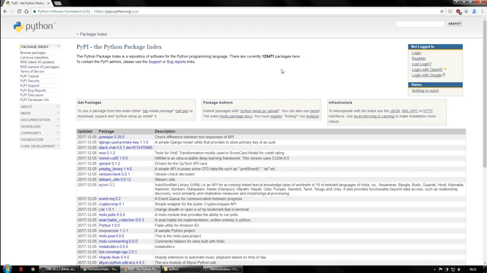
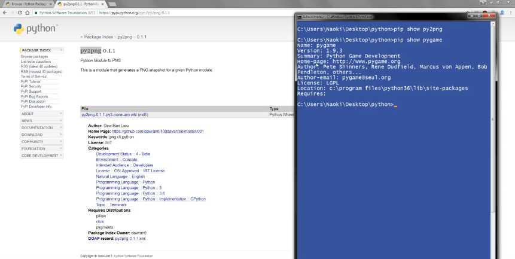

# [Installer des paquets](https://www.youtube.com/watch?v=MxvLhp9xJo4)

[Documentation pip](https://pip.pypa.io/en/stable/)  

Tutoriel pour montrer un gestionnaire de paquets que l'on va pouvoir utiliser pour installer tout un tas de bibliothèques tierces que l'on pourra utiliser dans nos programmes et nos projets python.

Pour commencer à installer l'outil nous allons passer par un terminal en administrateur si on est sur Windows ou bien via des commandes root si on est sur MacOS ou Linux.

Voilà nous allons ouvrir un terminal en administrateur.

```powershell

```

Cet outil s'appelle simplement `pip` pour python `install package` voilà c'est un diminutif qui a été raccourci pour faire nos installations avec python.

Pour information cet outil est installé par défaut depuis python 3.4 ou sur la version 2.7.9 mais si on ne dit pas de bêtises normalement vous travaillez avec python version 3 minimum donc il n'y a pas de souci devrait être installé.

```powershell
PS C:\WINDOWS\system32> pip

Usage:
  pip <command> [options]

Commands:
  install                     Install packages.
  download                    Download packages.
#...
```

Voilà la commande `pip` et bien reconnue et donc l'outil est bien installé.

Par ailleurs si l'outil `pip` n'est pas installé, vous pouvez tenter l'installation en faisant `python…` ou `python3…` si vous êtes sur Linux ou MacOS et ensuite la commande complète `python -m ensurepip --default-pip`.

```powershell
python -m ensurepip --default-pip
```

Voilà la commande pour installer l'outil `pip`, notre gestionnaire de paquets.

Normalement il doit être disponible par défaut et on peut même vérifier sa version en faisant `pip --version`.

```powershell
PS C:\WINDOWS\system32> pip --version
pip 21.1.3 from c:\users\sam\appdata\local\programs\python\python39\lib\site-packages\pip (python 3.9)
```

Nous sommes à la version 9.0.1 au moment où cette vidéo est réalisée.

La première chose à faire avant d'utiliser les commandes de cet outil, c'est de le mettre à jour pour être sûr d'avoir la version la plus récente et donc pour ça vous allez faire `python…` ou bien `python3…` sur Linux sur Mac OS et donc la commande complète c'est `python -m pip install --upgrade`

```powershell
python -m pip install --upgrade
```

S'il nous met up-to-date, cela veut dire que j'ai déjà la version la plus à jour.


Faites ça pour avoir la version la plus récente et comme ça on sera sûr d'avoir la même version pour faire cette vidéo.

À partir de là du fait que python c'est libre, open source et qu'il y un accès et que c'est très ouvert au niveau de la communauté d'accord il y a beaucoup de gens qui ont contribué à son évolution et qui ont développé leur propre package donc un ensemble de modules, de fonction et cetera.

Ainsi ils ont soumis un dépôt officiel, un dépôt communautaire qui contient tout un tas de choses.

Nous l'intérêt c'est de pouvoir accéder à ce dépôt et de pouvoir installer des paquets depuis ce dépôt.

Ce paquet ça peut être le *python package index* ou bien simplement le `PyPI` ou le P.P.I. comme certains le disent parfois qui est accessible depuis le site python.org et par rapport au menu nous allons sur le `PyPI`.

https://pypi.org/

Nous tombons sur ce genre de page avec l'ensemble des paquets qui sont disponibles alors au moment où on fait cette vidéo vous voyez qu'il y a quand même 123471 packages qui sont disponibles.



Alors Notez que si vous voulez faire quelque chose de précis en python, faites simplement une recherche sur internet parce qu'il y a 99% de chance qu'il y ait déjà un package qui vous permettent de le faire simplement sauf si bien sûr vous avez envie de développer votre propre module vous-même.

Rendez-vous sur le *Browse Project* où tout est rangé par catégories.

https://pypi.org/search/

Voilà on trouve pas mal de petites choses par rapport au système, par rapport aux versions précises de python, pour les e-mails, pour des chats, le chargement de fichiers et cetera.


Voilà nous avons un moteur de recherche pour faire de la recherche mais du coup comment allons-nous pouvoir installer un paquet.

## pip install

Par exemple nous allons prendre le paquet *Python Module to PNG* (py2png).

https://pypi.org/project/py2png/

Voilà on va prendre ce paquet-là, *py2png* pour lequel on va juste récupérer son nom mais ne prenez pas ici le numéro de version 0.1.1 donc on a juste besoin du nom, et s'il y a des majuscules il faut respecter les majuscules donc on fait juste un copier coller on va pouvoir installer tout ce qu'il faut à ce niveau-là.

Pour installer le paquet que l'on veut on fait simplement `pip install <nom_du_paquet>` et je vais l'installer.

Pour rappel, on est toujours en admistrateur.

```powershell
PS C:\WINDOWS\system32> pip install py2png
Collecting py2png
  Downloading py2png-0.1.1-py3-none-any.whl (3.3 kB)
Collecting click
  Downloading click-8.0.1-py3-none-any.whl (97 kB)
     |████████████████████████████████| 97 kB 952 kB/s
Collecting pillow
  Downloading Pillow-8.3.1-1-cp39-cp39-win_amd64.whl (3.2 MB)
     |████████████████████████████████| 3.2 MB 2.2 MB/s
Collecting pygments
  Downloading Pygments-2.9.0-py3-none-any.whl (1.0 MB)
     |████████████████████████████████| 1.0 MB 3.2 MB/s
Collecting colorama
  Downloading colorama-0.4.4-py2.py3-none-any.whl (16 kB)
Installing collected packages: colorama, pygments, pillow, click, py2png
Successfully installed click-8.0.1 colorama-0.4.4 pillow-8.3.1 py2png-0.1.1 pygments-2.9.0
```

Voyez qu'il récupère le package, il le télécharge et il l'installe.

Voilà c'est simplement un gestionnaire de paquet qui aura du coup une espèce de base de données pour savoir ce qui l'a installé ou non et pareil on va pouvoir facilement le désinstaller.

La commande inverse `pip uninstall<nom_du_paquet>`.

```powershell
PS C:\WINDOWS\system32> pip uninstall py2png
Found existing installation: py2png 0.1.1
Uninstalling py2png-0.1.1:
  Would remove:
    c:\users\sam\appdata\local\programs\python\python39\lib\site-packages\py2png-0.1.1.dist-info\*
    c:\users\sam\appdata\local\programs\python\python39\lib\site-packages\py2png.py
    c:\users\sam\appdata\local\programs\python\python39\scripts\py2png.exe
Proceed (y/n)? y
  Successfully uninstalled py2png-0.1.1
```

## pip search

Voilà il nous demande également si on veut désinstaller l'exécutable, on met oui et comme ça on est sûr qu'il ne reste pas de résidu ou de choses qui traine par rapport à son paquet.

Alors si on veut on peut directement télécharger le paquet **.whl** mais il est recommandé de le faire en ligne de commande avec l'outil pip ce qui est beaucoup plus pratique donc on a juste besoin de taper `pip install` ou `pip uninstall` pour gérer l'installation et là désinstallation ce qui est très rapide et très pratique en plus de l'affichage dans le terminal donc ça fonctionne très bien.

Dans certains cas vous avez peut-être besoin de rechercher un paquet en rapport avec un autre, par rapport à un terme et on peut penser éventuellement à ceux qui font de la 2D avec pygame. Admettons que je veux rechercher dans ce dépôt tout ce qui est plus ou moins lié à Pygame donc je peux utiliser la commande `pip search pygame`.

`pip search pygame > results.txt` pour retourner le résultat dela commande dans un fichier pour plus de clareté.

:warning:`pip search`est hors service mais on peut utiliser le moteur de recherches en ligne https://pypi.org/search/?q=pygame d'ailleurs il nous retourne simplement pygame *Pygame 2.0.1* pour la 2D.

On retrouve d'autres choses comme une bibliothèque pour la caméra sur Pygame *pygame_camera*, un framework pour pygame *pygame-gui*, et cetera.

Dés qu'on en a besoin, on peut télécharger par exemple une démo pour un jeu `pip install MysteriousBlade`, c'est vraiment très simple même avec ce paquet plus conséquent.

On peut également retourner des informations sur un paquet précis en faisant `pip show py2png` à la condition le développeur a mis une description mais ce n'est pas une obligation.

```powershell
PS C:\WINDOWS\system32> pip show py2png
WARNING: Package(s) not found: py2png

PS C:\WINDOWS\system32> pip show pygame
WARNING: Package(s) not found: pygame

PS C:\WINDOWS\system32> pip show MysteriousBlade
WARNING: Package(s) not found: MysteriousBlade
```

:warning: pareil pas de résultat retourné.



Alors dans la vidéo avec `pip show pygame`, on obtient bien des informations et donc parfois c'est un petit peu dommage c'est le développeur n'a pas rempli ces informations. Comme vous pouvez le voir on a le nom du package, la dernière version, le nom complet (Summary) ainsi que le site du projet officiel (Home-page), les auteurs, la licence et même l'endroit où s'est installé sur notre ordinateur (Location).

Pas mal d'informations intéressantes.

Parfois il y a l'e-mail, ce qui peut être intéressant pour en contacter le développeur parce qu'on a trouvé un bug ou simplement pour lui demander d'ajouter une fonctionnalité donc ça peut vraiment être intéressant de récupérer ces informations là.

## pip freeze

Alors en bonus mais avant comme vous le savez il y a un tutoriel en python qui vous propose l'installation d'environnements virtualisés et donc admettons qu'un jour on veut créer un nouvel environnement donc j'aimerais installer tous les package que j'avais mis sur le système.

Ainsi vous vous doutez bien que vous allez pas aller dans le dossier des packages et récupérer tous les noms un par un, et tout installer un à un ce qui serait beaucoup trop long.

Pour faire simple il suffit d'utiliser la commande `pip freeze` et si je la fais par défaut elle va me lister toute la liste des packages.

```powershell
PS C:\WINDOWS\system32> pip freeze
click==8.0.1
colorama==0.4.4
Pillow==8.3.1
Pygments==2.9.0
```

Voilà elle nous retourne toute la liste des packages installés avec leur numéro de version actuelle donc ça on peut éventuellement le récupérer dans un fichier qu'on appelle habituellement requirements.txt

```powershell
pip freeze > requirements.txt
```

Voilà ce fichier va contenir exactement ce type de formatage.

Plutôt que de devoir installer chacun des package en a un, il nous suffit de faire cette commande sur notre environnement ou on veut toutes les installer avec le chemin vers le nom de fichier requirements.txt `` ce qui va permettre de lire le fichier avec tous les paquets et leur version donc ça vraiment très pratique si on veut avoir quelque chose à jour et de ne pas retaper l'installation de tous nos paquets un à un, ce qui peut être assez embêtant si on a plusieurs environnements.

```powershell
pip install -r requirements.txt
```

Ainsi avec la commande freeze, on peut déjà récupérer tous les paquets que nous avons installé pour pouvoir ensuite les installer sur un autre environnement ce qui nous fait gagner énormément de temps.

Voilà l'outil pip est vraiment très puissant de gestionnaire de paquets.

La documentation,
https://pip.pypa.io/en/stable/

À partir de la documentation de pip, on peut trouver par exemple des exemples de commandes pour pouvoir installer des versions plus anciennes en utilisant les opérateurs inférieurs à ou égal (<=) et qui nous permettent d'installer des versions très précise des packages mais également selon la différente version python.