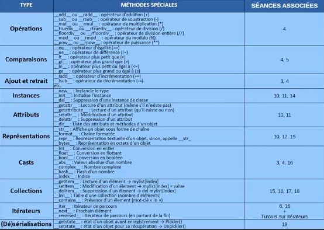

# [Méthodes spéciales](https://www.youtube.com/watch?v=XxUasK8f-s0)

En pré requis, il faut avoir vu ce qui était une classe, un attribut, une méthode donc la notion que nous allons voir ensemble peut être très complexe parce qu'il y a beaucoup de choses.

Alors qu'est ce qu'on entend par méthode spéciale ? ce sont des méthodes qui existent de manière native avec le langage python. Par exemple vous avez vu que quand on crée une classe, on pouvait créer nos propres méthodes donc par exemple une classe Lapin, on va faire le constructeur et ensuite on pouvait assigner des attributs à cette classe par rapport au constructeur. Et puis on crée une instance de cette classe et cetera.

```py
#coding:utf-8

class Lapin:
    def __init__(self, name, weight):
        self.name = name
        self.weight = weight

lp = Lapin("Coco", 25)
```

Alors on avait vu qu'il y a certaines méthodes comme celle-ci avec un double underscore __init__(), est une méthode particulière dont on va parler dans ce tutoriel aujourd'hui. Cette méthode fait partie des méthodes spéciales qui est connue du langage python. À l'opposé nous avons des méthodes simples comme par exemple hello().

```py
#coding:utf-8

class Lapin:
    def __init__(self, name, weight):
        self.name = name
        self.weight = weight

    def hello(self):
        print("Hello ! :)")

lp = Lapin("Coco", 25)
lp.hello()
```
```powershell
> python main.py
Hello ! :)
```

Ici ce n'est pas une méthode spécial parce que c'est une méthode que j'ai fait moi-même ainsi méthode spéciale c'est une méthode directement native de python.

Alors il y a tout un tas de méthodes spéciales dont on ne pourra pas tout citer, alors je vous ai rassemblé les plus courants dans un grand tableau ici.

|CATÉGORIE|MÉTHODES|UTILISATION|SÉANCES<br>ASSOCIÉES
|:--:|:--|:--|:--:|
|Opérations|`object.__add__(self, other)` ou `object.__radd__(self, other)` <br> `object.__sub__(self, other)` ou `object.__rsub__(self, other)` <br> `object.__mul__(self, other)` ou `object.__rmul__(self, other)` <br> `object.__truediv__(self, other)` ou `object.__rtruediv__(self, other)` <br> `object.__floordiv__(self, other)` ou `object.__rfloordiv__(self, other)` <br> `object.__mod__(self, other)` ou `object.__rmod__(self, other)` <br> `object.__pow__(self, other[, modulo])` ou `object.__rpow__(self, other[, modulo])` | opérateur d'addition (+) <br> opérateur de soustraction (-) <br> opérateur de multiplication (*) <br> opérateur de division (/) <br> opérateur de division entière (//) <br> opérateur de modulo (%) <br> opérateur de puissance (**)|4|
|Comparaisons|`object.__eq__(self, other)` <br> `object.__ne__(self, other)` <br> `object.__lt__(self, other)` <br> `object.__gt__(self, other)` <br> `object.__le__(self, other)` <br> `object.__ge__(self, other)`|opérateur d'égalité (==) <br> opérateur de différence (!=) <br> opérateur plus petit que (<) <br> opérateur plus grand que (>) <br> opérateur plus petit ou égal à (<=) <br> opérateur plus grand ou égal à (>=)|4,5|
|Ajout et retrait|`object.__iadd__(self, other)` <br> `object.__isub__(self, other)` <br> etc.|opérateur d'incrémentation (+=) <br> opérateur de décrémentation (-=) <br> etc.|3,4|
|Instances|`object.__new__(cls[, ...])` <br> `object.__init__(self[, ...])` <br> `object.__del__(self)`|instancie le type <br> initialise l'instance <br> suppression d'une instance de classe|10,11,14|
|Attributs|`object.__getattr__(self, name)` <br> `object.__getattribute__(self, name)` <br> `object.__setattr__(self, name, value)` <br> `object.__delattr__(self, name)` <br> `object.__dir__(self)`|lecture d'un attribut (même s'il n'existe pas) <br> lecture d'un attribut (qu'il existe ou non) <br> modification d'un attribut <br> suppression d'un attribut <br> liste des attributs et méthodes d'un objet|10,11|
|Représentations|`object.__str__(self)` <br> `object.__format__(self, format_spec)` <br> `object.__repr__(self)` <br> `object.__bytes__(self)`|affiche un objet sous forme de chaîne <br> chaîne formatée <br> représentation textuelle d'un objet, sinon appelle `__str__` <br> représentation en octets d'un objet|10, 12, 15|
|Casts|`object.__int__(self)` <br> `object.__float__(self)` <br> `object.__bool__(self)` <br> `object.__abs__(self)` <br> `object.__complex__(self)` <br> `object.__hash__(self)` <br> `object.__index__(self)`|conversion en entier <br> conversion en flottant <br> conversion en booléen <br> valeur absolue d'un nombre <br> nombre complexe <br> hash d'un nombre <br> indice|3, 4, 16|
|Collections|`object.__getitem__(self, key)` <br> `object.__setitem__(self, key, value)` <br> `object.__delitem__(self, key)` <br> `object.__len__(self)` <br> `object.__contains__(self, item)`|lecture d'un élément -> `mylist[index]` <br> modification d'un élément -> `mylist[index] = value` <br> suppression d'un élément -> `del mylist[index]` <br> taille d'une collection (nombre d'éléments) <br> présence d'un élément (mot-clé `in`)|15, 16, 17, 18|
|Itérateurs|`object.__iter__(self)` <br> `object.__anext__(self)` <br> `object.__reversed__(self)`|itérateur de parcours <br> prochain élément <br> itérateur de parcours (en partant de la fin)|6, 16 + tutoriel sur les itérateurs|
|(Dé)sérialisations|`object.__getstate__()` <br> `object.__setstate__(state)`|état d'un objet avant enregistrement -> `Pickler()` <br> état d'un objet pour sa récupération -> `Unpickler()`|19|
<!--

-->

Voilà pour toutes les méthodes spéciales avec leur séance de cours associé. On va regarder au maximum 2 exemples parce qu'il y en a beaucoup trop.

Alors ce qu'il faut comprendre ici c'est que par défaut on peut modifier tout le contenu de python, son comportement c'est à dire que par défaut toutes ces méthodes spéciales sont définies par python par exemple ici le constructeur de lapin si je voulais je pourrais ne pas le faire du tout et l'interpréteur en ferait un par défaut.

```py
#coding:utf-8

class Lapin:
>   def __init__(self, name, weight):
>       self.name = name
>       self.weight = weight

    def hello(self):
        print("Hello ! :)")

lp = Lapin("Coco", 25)
lp.hello()
```

Si on ne définissait pas un constructeur pour notre classe lapin, l'interpréteur python en ferait un par défaut à sa manière à lui.

## __repr__

Ainsi toutes ces méthodes sont prévus avec un fonctionnement de base mais si on veut on peut les changer, la première que je vais vous présenter ici c'est celle qui va nous représenter un objet.

Par exemple si je fais un print() de mon instance de lapin (lp).

```py
#coding:utf-8

class Lapin:
    def __init__(self, name, weight):
        self.name = name
        self.weight = weight

    def hello(self):
        print("Hello ! :)")

lp = Lapin("Coco", 25)
print(lp)
```
```powershell
> python main.py
<__main__.Lapin object at 0x000001697A67FA00>
```

Si je fais un print() de mon objet lapin, j'obtiens donc cette drôle de ligne avec en premier lieu un attribut un peu spécial `__main__` qui définit le fichier ici de démarrage puis on a un objet Lapin `__main__.Lapin` et enfin une adresse où il est stocké en mémoire, ce qui n'est pas une information pertinente et importante du tout surtout pour un utilisateur.

Moi par exemple j'aimerais bien qu'on affiche le nom du lapin et son poids, on va donc pouvoir recréer redéfinir le comportement de cette méthode spéciale qui est la méthode `__repr__()`.


|CATÉGORIE|MÉTHODES|UTILISATION|SÉANCES<br>ASSOCIÉES
|:--:|:--|:--|:--:|
|Représentations|`object.__repr__(self)`|représentation textuelle d'un objet, sinon appelle `__str__`|10, 12, 15|

`__repr__()` qui est la représentation textuelle d'un objet, et que si elle n'existait pas l'interpréteur va chercher la méthode spéciale `__str__()` donc nous de la même manière on va réécrire `__repr__()` etil faut savoir que par défaut cette méthode renvoie ceci `<__main__.Lapin object at 0x000001697A67FA00>`.

Voilà comment elle est définie par défaut de manière native mais nous on va la réécrire donc en premier paramètre elle va prendre l'instance en elle-même, l'objet en cours (self) et on va lui donner directement des informations et on va simplement retourner une chaîne de texte avec la méthode format().

```py
#coding:utf-8

class Lapin:
    def __init__(self, name, weight):
        self.name = name
        self.weight = weight

    def hello(self):
        print("Hello ! :)")
    
    def __repr__(self):
        return "Lapin {} de {}kg.".format(self.name, self.weight)

lp = Lapin("Coco", 25)
print(lp)
```
```powershell
> python main.py
Lapin Coco de 25kg.
```

À partir de ce moment-là comment on a redéfini une méthode spéciale pour notre classe, à chaque fois qu'on va vouloir faire comme ça un petit print() de notre objet, il n'y aura pas besoin de réécrire une méthode pour ça genre getInfo() ou je ne sais quoi ! non on aura juste à redéfinir cette méthode spéciale `__repr__(self)` et du coup avec un simple print() on peut modifier la représentation de notre objet.

Voilà ça c'est la méthode pour représenter un objet, `__repr__()`, représentées sous forme textuelle et on peut utiliser comme ça un petit formatage pour bien représenter nos attributs donc vous pouvez en faire ce que vous voulez et comme ça on aura juste à faire un petit print() sur notre objet `print(lp)`. Ainsi tous les objets de classe lapin, retourneront ce petit formatage.

##

Alors un autre exemple que je voulais vous montrer parce que c'est important comme dans d'autres langages tels que le c++, c'est ce qu'on appelle la surcharge d'opérateur.

Lorsqu'on a vu la vidéo sur les conditions quand on a étudié les opérations et tout ça, on peut sans problème faire une condition pour comparer 2 nombres par exemple les comparer et dire que l'un est plus petit que l'autre et à la rigueur vérifier qu'une chaîne est plus petite que l'autre par rapport à son emplacement dans la table ascii parce que vous savez que les caractères sont codés alors qu'un ordinateur ne sait manipuler et faire des captures que de nombres par exemple il ne sera pas comment manipuler des lapins.

Admettons d'abord qu'on crée un 2e lapin, comment allons-nous pouvoir faire ce test `lp == lp2`.

```py
#coding:utf-8

class Lapin:
    def __init__(self, name, weight):
        self.name = name
        self.weight = weight

    def hello(self):
        print("Hello ! :)")
    
    def __repr__(self):
        return "Lapin {} de {}kg.".format(self.name, self.weight)

lp = Lapin("Coco", 25)
lp2 = Lapin("Titi", 7)

if lp == lp2:
    print("Ce sont les mêmes")
else:
    print("Ces lapins sont différents")
```

Comme je vous l'ai dit si on avait juste manipulé des nombres ça aurait été simple c'est à dire que mon interpréteur s'en aurais sortis sans problème. Pour mon interpréteur lp et lp2, ce sont des lapins et donc comment est-ce qu'il va comparer des lapins ? On est bien d'accord qu'il en est incapable d'ailleurs si j'essaie d'exécuter ce code, il va me dire simplement qu'ils sont différents.

```powershell
> python main.py
Ces lapins sont différents
```

Voilà il nous dit simplement que les lapins sont différents pourquoi? Parce que rappelez vous que lp et lp2 sont la représentation on aura automatiquement 2 phrases différentes.

```py
#coding:utf-8

class Lapin:
    def __init__(self, name, weight):
        self.name = name
        self.weight = weight

    def hello(self):
        print("Hello ! :)")

lp = Lapin("Coco", 25)
lp2 = Lapin("Titi", 7)

print(lp)
print(lp2)
```
```powershell
> python main.py
<__main__.Lapin object at 0x000001B33FED8E80>
<__main__.Lapin object at 0x000001B33FED8DC0>
```

Vous voyez que les 2 adresses sont différentes et du coup l'interpréter voit que c'est pas pareil elle dit que c'est différent mais moi dans mon cas je voudrais pouvoir dire dans mon programme que 2 lapins sont identiques à partir du moment où ils font le même poids alors que dans la réalité ce ne serait pas vrai il faudrait qu'ils soient clonés, qu'ils aient le même nom, qu'ils ont le même ADN et cetera.

Bref on pourrait partir loin, mais on va partir d'une manière arbitraire de dire que 2 lapins doivent avoir le même poids pour être identique, alors comment est-ce que je vais pouvoir faire ça ? Je vais surcharger un opérateur donc ça revient à redéfinir une méthode spéciale et notamment la méthode qui concerne l'opérateur d'égalité donc par exemple par rapport au tableau que l'on a reçu on a le `__eq__()`.

|CATÉGORIE|MÉTHODES|UTILISATION|SÉANCES<br>ASSOCIÉES
|:--:|:--|:--|:--:|
|Comparaisons|`object.__eq__(self, other)`|opérateur d'égalité (==)|4,5|

C'est pour dire `equal` donc l'opérateur d'égalité (==) donc je vais redéfinir l'opérateur d'égalité mais toujours dans ma classe Lapin, et là qu'est ce qu'on va comparer? On va comparer `self` donc c'est l'instance présente donc c'est le premier lapin l'objet en lui-même, et ensuite on va l'appeler `other` qui sera le 2e lapin donc nous allons comparer ça.

```py
def __eq__(self, other):
```
C'est nous qui choisissons maintenant les tests à faire pour vérifier qu'un lapin est égal à un autre donc ils sont identiques, et on avait parlé qu'il serait identique à partir du moment où le poids est le même donc on peut faire ce test çi.

```py
def __eq__(self, other):
    if self.weight == other.weight:
        return True
    return False
```
```py
#coding:utf-8

class Lapin:
    def __init__(self, name, weight):
        self.name = name
        self.weight = weight

    def hello(self):
        print("Hello ! :)")
    
    def __eq__(self, other):
        if self.weight == other.weight:
            return True
        return False

lp = Lapin("Coco", 25)
lp2 = Lapin("Titi", 7)

if lp == lp2:
    print("Ce sont les mêmes")
else:
    print("Ces lapins sont différents")
```
```powershell
> python main.py
Ces lapins sont différents
```

On voit que les poids sont toujours différents mais maintenant c'est je mets un poids identique, il vous dira que les lapins sont bien les mêmes.

```py
#coding:utf-8

class Lapin:
    def __init__(self, name, weight):
        self.name = name
        self.weight = weight

    def hello(self):
        print("Hello ! :)")
    
    def __eq__(self, other):
        if self.weight == other.weight:
            return True
        return False

lp = Lapin("Coco", 7)
lp2 = Lapin("Titi", 7)

if lp == lp2:
    print("Ce sont les mêmes")
else:
    print("Ces lapins sont différents")
```
```powershell
> python main.py
Ce sont les mêmes
```

Vous voyez qu'on a simplement surchargé l'opérateur d'égalité, et on peut effectivement maintenant comparer des lapins, chose que le python en lui-même ne peut pas faire parce que maintenant il sait ce qu'il faut comparer c'est-à-dire des attributs en particulier d'ailleurs on peut même encore raccourcir cette surcharge en retournant directement le résultat du test, ce qui reviendra exactement à la même chose.

```py
def __eq__(self, other):
    return self.weight == other.weight:
```

Voilà c'est simplement la même chose c'est simplement que ça raccourcit les écritures.

```powershell
> python main.py
Ce sont les mêmes
```

Voilà comment on peut tout simplement surcharger cet opérateur là (==). 

C'est pareil il y a également des opérateurs pour faire les additions, par exemple si je veux pouvoir additionner lp avec lp2, comment ferait on ? Parce que c'est un peu bizarre de pouvoir se dire qu'on puisse additionner des lapins, suivant nos méthodes on pourra redéfinir l'opérateur d'addition qui est `__add__()`.

|CATÉGORIE|MÉTHODES|UTILISATION|SÉANCES<br>ASSOCIÉES
|:--:|:--|:--|:--:|
|Opérations|`object.__add__(self, other)` ou `object.__radd__(self, other)`| opérateur d'addition (+)|4|

Voilà je ne sais pas comment mais on pourrait additionner des lapins.

Si on prend quelque chose de plus plausible que le lapin, ça pourrait être par exemple des heures c'est-à-dire qu'on est d'accord les heures ne sont pas simplement des nombres qui vont de 1 à 100 lancer arrivé à 60 min on a 1h et cetera donc là on peut imaginer que ça peut être intéressant de faire par exemple une addition de minutes qui du coup devra être converti d'une certaine manière pour bien avoir les heures correspondantes et cetera.

Voilà un site quelques exemples intéressants.

Nous avons vu ici là redéfinition d'une méthode comme la représentation d'un objet et une surcharge d'opérateur tel que `__eq__()` parce que c'est quelque chose qu'on aura souvent besoin de faire par exemple dans un jeu vidéo on aura besoin de comparer des armes, des personnages, des monstres et pas mal d'autres choses donc ça nous servira.

Pour le reste nous avons pas mal de méthodes intéressantes, et d'autres qui nous serviront au moins mais ce n'est pas grave.

Pour rappel ce qui est dans la partie tutoriel n'est pas obligatoire mais tout ce qui est dans la formation de cours est bien à connaître mais ce qui est dans la partie tutoriel c'est vraiment des bonus et des plus, et si on ne les connaît pas en python ce n'est pas bien grave on pourra quand même programmer sans les méthodes spéciales mais après c'est bien de savoir qu'elles existent quand même et de savoir qu'on peut les redéfinir ce qui est toujours très intéressant.

Alors on aurait pu parler de énormément de choses mais on va s'arrêter là pour cette vidéo, on aurait pu faire un exemple avec toutes ces méthodes spéciales.

Les explications ici dans le tableau sont suffisamment claires pour voir à quoi ça correspond avec par exemple `__getitem__()` qui permet quand on a une liste `mylist[index]` et puis qu'on essaye d'accéder à une liste donc le énième élément d'une liste puis dans le cours avec les itérateurs qu'on voit également avec le tutoriel associé à condition qu'il soit déjà sorti au moment ou je fais cette vidéo.

|CATÉGORIE|MÉTHODES|UTILISATION|SÉANCES<br>ASSOCIÉES
|:--:|:--|:--|:--:|
|Opérations|`object.__add__(self, other)` ou `object.__radd__(self, other)` <br> `object.__sub__(self, other)` ou `object.__rsub__(self, other)` <br> `object.__mul__(self, other)` ou `object.__rmul__(self, other)` <br> `object.__truediv__(self, other)` ou `object.__rtruediv__(self, other)` <br> `object.__floordiv__(self, other)` ou `object.__rfloordiv__(self, other)` <br> `object.__mod__(self, other)` ou `object.__rmod__(self, other)` <br> `object.__pow__(self, other[, modulo])` ou `object.__rpow__(self, other[, modulo])` | opérateur d'addition (+) <br> opérateur de soustraction (-) <br> opérateur de multiplication (*) <br> opérateur de division (/) <br> opérateur de division entière (//) <br> opérateur de modulo (%) <br> opérateur de puissance (**)|4|
|Comparaisons|`object.__eq__(self, other)` <br> `object.__ne__(self, other)` <br> `object.__lt__(self, other)` <br> `object.__gt__(self, other)` <br> `object.__le__(self, other)` <br> `object.__ge__(self, other)`|opérateur d'égalité (==) <br> opérateur de différence (!=) <br> opérateur plus petit que (<) <br> opérateur plus grand que (>) <br> opérateur plus petit ou égal à (<=) <br> opérateur plus grand ou égal à (>=)|4,5|
|Ajout et retrait|`object.__iadd__(self, other)` <br> `object.__isub__(self, other)` <br> etc.|opérateur d'incrémentation (+=) <br> opérateur de décrémentation (-=) <br> etc.|3,4|
|Instances|`object.__new__(cls[, ...])` <br> `object.__init__(self[, ...])` <br> `object.__del__(self)`|instancie le type <br> initialise l'instance <br> suppression d'une instance de classe|10,11,14|
|Attributs|`object.__getattr__(self, name)` <br> `object.__getattribute__(self, name)` <br> `object.__setattr__(self, name, value)` <br> `object.__delattr__(self, name)` <br> `object.__dir__(self)`|lecture d'un attribut (même s'il n'existe pas) <br> lecture d'un attribut (qu'il existe ou non) <br> modification d'un attribut <br> suppression d'un attribut <br> liste des attributs et méthodes d'un objet|10,11|
|Représentations|`object.__str__(self)` <br> `object.__format__(self, format_spec)` <br> `object.__repr__(self)` <br> `object.__bytes__(self)`|affiche un objet sous forme de chaîne <br> chaîne formatée <br> représentation textuelle d'un objet, sinon appelle `__str__` <br> représentation en octets d'un objet|10, 12, 15|
|Casts|`object.__int__(self)` <br> `object.__float__(self)` <br> `object.__bool__(self)` <br> `object.__abs__(self)` <br> `object.__complex__(self)` <br> `object.__hash__(self)` <br> `object.__index__(self)`|conversion en entier <br> conversion en flottant <br> conversion en booléen <br> valeur absolue d'un nombre <br> nombre complexe <br> hash d'un nombre <br> indice|3, 4, 16|
|Collections|`object.__getitem__(self, key)` <br> `object.__setitem__(self, key, value)` <br> `object.__delitem__(self, key)` <br> `object.__len__(self)` <br> `object.__contains__(self, item)`|lecture d'un élément -> `mylist[index]` <br> modification d'un élément -> `mylist[index] = value` <br> suppression d'un élément -> `del mylist[index]` <br> taille d'une collection (nombre d'éléments) <br> présence d'un élément (mot-clé `in`)|15, 16, 17, 18|
|Itérateurs|`object.__iter__(self)` <br> `object.__anext__(self)` <br> `object.__reversed__(self)`|itérateur de parcours <br> prochain élément <br> itérateur de parcours (en partant de la fin)|6, 16 + tutoriel sur les itérateurs|
|(Dé)sérialisations|`object.__getstate__()` <br> `object.__setstate__(state)`|état d'un objet avant enregistrement -> `Pickler()` <br> état d'un objet pour sa récupération -> `Unpickler()`|19|

Voilà vous avez tout ce qu'il faut ici n'hésitez pas encore une fois à vous entraîner, à utiliser cette petite méthode et les redéfinir si nécessaire surtout dans les différentes classes que vous allez créer et puis faire des tests dans vos programmes pour voir un petit peu comment cela fonctionne.

Encore une fois c'est pour vous il n'y en a pas assez que vous voulez aller plus loin, sur la doc officielle de python il y a l'ensemble des méthodes spéciales qui sont disponibles pour chaque chose mais on en a déjà quelques unes ici et il y en a encore d'autres. Il y en a par exemple pour pouvoir vérifier les arguments ce qui dépend des situations dans lequel on travaille.

On va s'arrêter là et je vous dis à très bientôt pour un nouveau tutoriel.

À la prochaine pour une nouvelle vidéo