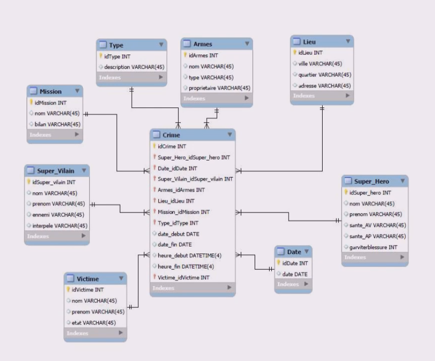

# [1. Introduction](https://www.youtube.com/watch?v=3KwmNNucIjA)
14-12-20

Bonjour à tous et bienvenue sur cette formation SQL. 

Dans cette introduction, je vais vous présenter ce qu'est ce langage SQL pour ceux éventuellement qui ne le connaissent pas, et vous détailler un petit peu ce qui vous attend sur cet ensemble de vidéo sur ce cours et tout ce que vous allez pouvoir apprendre. 

Alors on parle de langage SQL comme un langage qui n'est pas dit de programmation. Il ne s'agit pas ici de programmer, de créer des programmes qui pourrait être exécutés mais un langage qui va permettre de réaliser des requêtes. 

On parle donc de Structure Query Language.
```txt
	SQL
	* Structured Query Language
```
Un langage de requêtes structurées d'accord on va simplement faire des requêtes sur une base de données avec un ensemble d'informations qui seront organisés, ordonnés de manière relationnelle. On en parlera un peu par la suite.
```txt
	SQL
	* Structured Query Language
	* Conçu en 1974, normalisé en 1986
```
Ce langage SQL a été conçu en 1974 mais comme tout langage, ou toute technologie, à la base elle n'était pas forcément prévu pour être utilisé par le grand public ou par un ensemble de beaucoup d'utilisateurs donc il a fallu définir un ensemble de règles par la suite et ce langage a été normalisé en 1986 Pour pouvoir ensuite l'utiliser par plusieurs utilisateurs avec le même système de règles, la même syntaxe, les mêmes normes ce genre de chose voilà.
```txt
	SQL
	* Structured Query Language
	* Conçu en 1974, normalisé en 1986
	* Donald D. Chamberlin / Raymond F. Boyce
```
Alors les 2 créateurs, les 2 concepteurs du langage SQL sont Donald Chamberlin que vous voyez ici, et Raymon Boyce pour le quel je n'ai pas trouvé de photo.

Ce sont les 2 concepteurs du langage SQL qui à sa base travaillé chez IBM sûrement une entreprise que vous connaissez, le nom vous dit sûrement quelque chose. 

Voilà pour le petit historique très rapide SQL. 

Encore une fois c'est pareil si vous voulez en savoir un peu plus, un peu plus de détails sur les origines de SQL, vous pourrez vous renseigner sur internet, vous trouverez sûrement beaucoup de choses intéressantes.
```txt
	SQL
	* Structured Query Language
	* Conçu en 1974, normalisé en 1986
	* Donald D. Chamberlin / Raymond F. Boyce
	* Utilisé dans les SGBD(R):
```
Alors le SQL, on va l'utiliser dans des SGBD(R), j'ai marqué ça comme ça parce que c'est le diminutif enfaite pour désigner les systèmes de gestion de base de données et parfois vous entendrez même parler de bases de données relationnelles parce que les bases de données reposent ici sur un modèle relationnel quand j'aurai l'occasion de vous détailler, de vous expliquer tout au long de cette formation dans tous les cas. 

Alors les SGBDs vous en connaissez très certainement, je pense que beaucoup parmi vous en ont déjà utilisé ou en connaissent certainement parce que je vais vous sortir quelques exemples ici.
```txt
	SQL
	* Structured Query Language
	* Conçu en 1974, normalisé en 1986
	* Donald D. Chamberlin / Raymond F. Boyce
	* Utilisé dans les SGBD(R):
		MySQL
		ORACLE
		PostgreSQL
		SQL Server
```
On a par exemple le gros système de gestion Oracle qui est suffisamment connue. 

On a MySQL qui est très répandu aussi, on a SQL Server de Microsoft, on a SQLite, on a PostgreSQL noir et on en a beaucoup beaucoup beaucoup d'autres. 

Il y en a vraiment beaucoup d'autres. 

Je vous ai donné en tout cas les principaux, celle qui me venait en tête au moment où j'ai fait cette petite présentation mais il en existe évidemment beaucoup d'autres. 

Ces SGBD vont permettre tout simplement d'utiliser le langage SQL en leur sein pour pouvoir effectuer tout un tas de commandes, tout un tas de requêtes noir gérer des bases de données.
```txt
	SQL
	* Structured Query Language
	* Conçu en 1974, normalisé en 1986
	* Donald D. Chamberlin / Raymond F. Boyce
	* Utilisé dans les SGBD(R):
		MySQL
		ORACLE
		PostgreSQL
		SQL Server
	* Permet de:
```
Les bases de données grosso modo, elles vont permettre pas mal de choses et notamment ce langage SQL lui parce que c'est ça qui nous intéresse dans cette formation.
```txt
	SQL
	* Structured Query Language
	* Conçu en 1974, normalisé en 1986
	* Donald D. Chamberlin / Raymond F. Boyce
	* Utilisé dans les SGBD(R):
		MySQL
		ORACLE
		PostgreSQL
		SQL Server
	* Permet de:
		- Stocker des données (modèle relationnel)
```
Pour faire un résumé grosso modo, il va vous permettre de stocker des données suivant un modèle relationnel donc on parle de modèles relationnels parce que les données ne vont pas être stockées n'importe comment. 

Il ne s'agit pas par exemple d'avoir un fichier dans lequel on aurait mis tout un tas d'informations dedans sans qu'elle soit classées, triées, ordonnées. 

Ici on va les classer selon un système de relations c'est-à-dire que chaque donnée aura de relation avec d'autres mais je vais vous l'expliquer et vous allez comprendre via un schéma que je vous montrerai un petit peu plus tard.
```txt
	SQL
	* Structured Query Language
	* Conçu en 1974, normalisé en 1986
	* Donald D. Chamberlin / Raymond F. Boyce
	* Utilisé dans les SGBD(R):
		MySQL
		ORACLE
		PostgreSQL
		SQL Server
	* Permet de:
		- Stocker des données (modèle relationnel)
		- Manipuler ces données (requêtes, procédures, ...)
```
Ça va vous permettre également de manipuler ces données c'est à dire qu'une fois qu'on a des données stockées, on peut les manipuler, on peut effectuer des requêtes, on peut mettre en place des procédures pour effectuer des traitements sur ces données là. 

On peut bien évidemment ajouter de nouvelles données, en supprimer, en modifier et cetera. 

C'est tout ce système là qui concerne les manipulations des données sur ces bases là en SQL.
```txt
	SQL
	* Structured Query Language
	* Conçu en 1974, normalisé en 1986
	* Donald D. Chamberlin / Raymond F. Boyce
	* Utilisé dans les SGBD(R):
		MySQL
		ORACLE
		PostgreSQL
		SQL Server
	* Permet de:
		- Stocker des données (modèle relationnel)
		- Manipuler ces données (requêtes, procédures, ...)
		- Peut être employé dans un langage de programmation
```
On va pouvoir évidemment et c'est là tout l'intérêt de cette formation, l'employer dans un langage de programmation donc tout ce que vous allez apprendre sur cette formation SQL et que vous aurez acquis pourra vous servir avec d'autres langages. 

Si vous suivez par exemple ma formation PHP ou c++, python et cetera, que vous êtes amené à un moment donné à faire de la base de données, à faire du SQL, et bien utiliser tout ce que vous avez appris ici pour vous en servir, l'employé via un langage de programmation. 

Ce sera toute utile et c'est pour ça que je fais cette formation là, elle est indépendante et vous pouvez très bien faire du SQL sans. 

C'est pour ça que j'ai marqué qu'elle peut être employée c'est à dire que ce n'est pas obligatoire, on peut faire par exemple du SQL simplement directement sous forme de procédure ou autre en exécution direct dans le SGBD ou on peut faire carrément des instructions SQL via une interface de programmation qui serait par exemple directement présenté en interne. 

Alors le choix d'avoir des instructions SQL employé dans un autre langage de programmation c'est une possibilité mais ce n'est pas une obligation. On n'est pas obligé d'utiliser un langage de programmation pour manipuler SQL. 

Les personnes qui gèrent par exemple des bases de données, ils ne font pas de programmation, ils ne font pas de PHP, ils ne font pas de c++, de python, ils gèrent juste leur base de données via un système de gestion mais vous dans ce cas, ça pourra vous aider à vous en servir si vous le voulez dans un langage de programmation pour manipuler par exemple une base de données pour un blog en PHP ou en python, manipuler pareil un ensemble de données pour une application web en SQLite éventuellement ou ce genre de chose.

C'est donc pas mal et pas mal intéressant, et surtout pourra vous servir pour d'autres formations ici.
```txt
	SQL
	* Structured Query Language
	* Conçu en 1974, normalisé en 1986
	* Donald D. Chamberlin / Raymond F. Boyce
	* Utilisé dans les SGBD(R):
		MySQL
		ORACLE
		PostgreSQL
		SQL Server
	* Permet de:
		- Stocker des données (modèle relationnel)
		- Manipuler ces données (requêtes, procédures, ...)
		- Peut être employé dans un langage de programmation
	* Exemple de représentation :
```

<!--
+-Type--------------------+	 +-Armes------------------------+  +-Lieu-----------------+
| idType INT			  |	 | idArmes INT			    	|  | idLieu INT			  |
| description VARCHAR(45) |	 | nom VARCHAR(45)				|  | ville VARCHAR(45)	  |
+-------------------------+	 | type VARCHAR(45)				|  | quartier VARCHAR(45) |
							 | propriétaire VARCHAR(45)		|  | adresse VARCHAR(45)  |
+-Mission-----------+		 +------------------------------+  +----------------------+
| idMission INT		|
| nom VARCHAR(45)	|	+-Crime-----------------------------+  +-Super_Hero-----------+
| bilan VACHAR(45)	|	| idCrime INT						|  | idSuper_hero INT	  |
+-------------------+	| Super_Hero_idSuper_hero INT		|  | nom VARCHAR(45)	  |
						| Date_idDate INT					|  | prenom VARCHAR(45)	  |
+-Super_Vilain--------+ | Super_Vilain_idSuper_vilain INT	|  | sante_AV VARCHAR(45) |
| id_Super_vilain INT |	| Armes_idArmes INT					|  | sante_AP VARCHAR(45) |
| nom VARCHAR(45)	  | | Lieu_idLieu INT					|  | garviterblessure INT |
| prenom VARCHAR(45)  | | Mission_idMission INT				|  +----------------------+
| ennemi VARCHAR(45)  | | Type_idType INT					|
| interpele VACHR(45) | | date_debut DATE					|  +-Date-------+
+---------------------+ | date_fin DATE						|  | idDate INT	|
						| heure_debut DATETIME(4)			|  | date DATE	|
+-Victime------------+	| heur_fin DATETIME(4)				|  +------------+
| idVictime INT		 |	| victime_idVictime INT				|
| nom VARCHAR(45)	 |	+-----------------------------------+
| prenom VARCHAR(45) |
| etat VARCHAR(45)	 |
+--------------------+
-->
Alors voici un exemple de représentation d'une petite base de données parce qu'il faut savoir qu'une base de données peut représenter des milliers, des millions et des millions de données d'accord même plusieurs téraoctets de données sur certaines grosses bases de données. 

 Par exemple vous pouvez prendre un hôpital, un chu, vous pouvez prendre une gestion pour un magasin pour tout un ensemble d'enseignes. Tout cela va être géré dans des bases de données et vous imaginez bien qu'il peut y avoir des milliers des millions de données différentes. 

Alors sur ce schéma on se rend bien compte du système relationnel alors c'est une base de données qui représenterait un système, une base de crimes tout simplement comme vous voyez ici et qui va posséder des relations. 

On voit par exemple qu'un crime peut être relié donc il a une relation avec un lieu, il peut avoir mis éventuellement en évidence une utilisation utilisation d'armes ce genre de chose. 

On va avoir un super vilain, on va avoir éventuellement un super héro, on aura une victime peut être potentiellement. 

Donc tout cela crée des relations. 

Là on voit que la table principale, c'est comme ça que ça s'appelle, est la table Crime mais elle peut éventuellement être reliée à d'autres tables donc tous ces rectangles ce sont des tables, on apprendra à créer et à travailler dessus et toutes les informations à l'intérieur pour chaque table ce sont les champs d'accord les champs de la table. 

Et toutes les liaisons que vous voyez ce sont en fait les relations qui sont créées d'accord entre les différentes tables parce que ça n'aurait aucun intérêt dans une base de données d'avoir des tables qui sont chacune isolée d'accord c'est pour ça qu'on parle de modèle relationnel. 

Il y a forcément des relations avec les tables entre elles automatiquement. 

Ici un crime ne peut pas rester isolé par rapport à un lieu, par rapport à une arme ou autre, c'est des choses qui sont reliées ensemble. 

Voilà un petit exemple de représentation que je trouvais suffisamment explicite et bien illustré pour vous montrer un petit peu à quoi ça ressembler et à quoi vous attendre au niveau de ce qui va être fais. 

Par la suite donc on apprendra à faire pas mal de petite manipulation sur ce genre de base de données.
```txt
	SQL
	* Structured Query Language
	* Conçu en 1974, normalisé en 1986
	* Donald D. Chamberlin / Raymond F. Boyce
	* Utilisé dans les SGBD(R):
		MySQL
		ORACLE
		PostgreSQL
		SQL Server
	* Permet de:
		- Stocker des données (modèle relationnel)
		- Manipuler ces données (requêtes, procédures, ...)
		- Peut être employé dans un langage de programmation
	* Exemple de représentation :
		...
	* Notre choix se portera sur...
```
Alors nous pour cette formation le choix se portera sur MySQL pour la simple et bonne raison qu'il est très répandu, il a une documentation qui est très fournie. 

Beaucoup, une très grosse communauté aussi donc beaucoup de choses que vous pouvez retrouver sur internet si vous avez le moindre problème, c'est une solution qui est gratuite, qui est open source, qui est multiplateforme donc voilà c'est disponible sur n'importe quel système d'exploitation donc ça paraît bien évidemment préférable contrairement à Oracle qui peut opposer une version payante ou SQL Server de Microsoft donc mon choix s'est porté pour cette formation sur MySQL qui sera très très bien ou en tout cas un bon choix pour ce que nous allons faire au sein de ces vidéos. 

Voilà pour ça. 

Alors j'ai résumé grosso modo ce qui va vous attendre sur cette formation, la liste n'est pas exhaustive mais c'est histoire de vous faire une idée de ce que vous allez trouver sur ce cours là.
```txt
	SQL
	* Structured Query Language
	* Conçu en 1974, normalisé en 1986
	* Donald D. Chamberlin / Raymond F. Boyce
	* Utilisé dans les SGBD(R):
		MySQL
		ORACLE
		PostgreSQL
		SQL Server
	* Permet de:
		- Stocker des données (modèle relationnel)
		- Manipuler ces données (requêtes, procédures, ...)
		- Peut être employé dans un langage de programmation
	* Exemple de représentation :
		...
	* Notre choix se portera sur...
	* Dans ce cours, nous verrons comment :
		- Installer le serveur MySQL et le démarrer
```
Vous allez donc tout simplement voir comment installer le serveur MySQL et le démarrer donc c'est ce que nous allons faire dans la vidéo prochaine. 

On le fera pour Windows, pour Linux, j'en parlerais un tout petit peu pour Mac mais encore une fois je ne peux pas faire le détail Pour Mac os puisque je n'ai pas de Mac sous la main mais je vous en parlerai quand même un petit peu pour que normalement vous puissiez vous débrouiller et l'installer aussi de votre côté. 

On verra donc tout ça pour que vous ayez l'outil en place donc on parle de serveur, on va démarrer un serveur MySQL et ensuite on pourra éventuellement se connecter dessus et faire tout un tas de choses donc on verra ça par la suite. 
```txt
	SQL
	* Structured Query Language
	* Conçu en 1974, normalisé en 1986
	* Donald D. Chamberlin / Raymond F. Boyce
	* Utilisé dans les SGBD(R):
		MySQL
		ORACLE
		PostgreSQL
		SQL Server
	* Permet de:
		- Stocker des données (modèle relationnel)
		- Manipuler ces données (requêtes, procédures, ...)
		- Peut être employé dans un langage de programmation
	* Exemple de représentation :
		...
	* Notre choix se portera sur...
	* Dans ce cours, nous verrons comment :
		- Installer le serveur MySQL et le démarrer
		- Exécuter nos premires commandes SQL
```
Vous verrez comment et on verra ensemble comment exécuter vos premières commandes SQL, de voir comment se passe la syntaxe, de voir comment ça s'écrit, comment sont renvoyer les résultats, de quelle manière donc on travaillera un peu là dessus pour exécuter nos premières commandes.
```txt
	SQL
	* Structured Query Language
	* Conçu en 1974, normalisé en 1986
	* Donald D. Chamberlin / Raymond F. Boyce
	* Utilisé dans les SGBD(R):
		MySQL
		ORACLE
		PostgreSQL
		SQL Server
	* Permet de:
		- Stocker des données (modèle relationnel)
		- Manipuler ces données (requêtes, procédures, ...)
		- Peut être employé dans un langage de programmation
	* Exemple de représentation :
		...
	* Notre choix se portera sur...
	* Dans ce cours, nous verrons comment :
		- Installer le serveur MySQL et le démarrer
		- Exécuter nos premires commandes SQL
		- Créer nos premières tables, organiser les relations
```
Une fois que vous aurez vu ça on pourra commencer à voir pour créer nos premières tables, on va organiser des relations entre celles-ci, organiser l'information, quelles données ont stock ce genre de choses. 

Et moi pour la suite donc au début on verra tout ça mais quand vous aurez bien appris ces choses-là, je pense que je vous proposerai un script SQL que vous pourrez comme ça apporter chacun de votre côté sur votre serveur pour en fait travailler sur la même base de données. 

On aura les mêmes bases de données avec les mêmes tables, les mêmes chants et cetera, comme ça pour toutes les vidéos que vous suivrez, Eh bien nous travaillerons sur les mêmes données, ce sera beaucoup plus simple beaucoup plus simple pour vous aider et aussi pour que vous puissiez apprendre. 

Le fait de travailler un petit peu tous sur les mêmes données ce sera beaucoup plus pratique. 

On fera donc ça et je vous proposerai ce script SQL en description vidéo ou dans la séance pour laquel ce sera utile de l'avoir donc on verra tout ça. 
```txt
	SQL
	* Structured Query Language
	* Conçu en 1974, normalisé en 1986
	* Donald D. Chamberlin / Raymond F. Boyce
	* Utilisé dans les SGBD(R):
		MySQL
		ORACLE
		PostgreSQL
		SQL Server
	* Permet de:
		- Stocker des données (modèle relationnel)
		- Manipuler ces données (requêtes, procédures, ...)
		- Peut être employé dans un langage de programmation
	* Exemple de représentation :
		...
	* Notre choix se portera sur...
	* Dans ce cours, nous verrons comment :
		- Installer le serveur MySQL et le démarrer
		- Exécuter nos premires commandes SQL
		- Créer nos premières tables, organiser les relations
		- Faire des requêtes, sélectionner des données, en ajouter...
```
Bien évidemment une fois qu'on vous serez un petit peu faire toutes ces choses-là, on commencera à travailler sur notre base de données donc on fera des requêtes, on ira sélectionner des données, on ira en ajouter, en supprimer, en modifier bref on ira faire tout un tas de manipulations là-dessus pour voir comment ça marche avec SQL.
```txt
	SQL
	* Structured Query Language
	* Conçu en 1974, normalisé en 1986
	* Donald D. Chamberlin / Raymond F. Boyce
	* Utilisé dans les SGBD(R):
		MySQL
		ORACLE
		PostgreSQL
		SQL Server
	* Permet de:
		- Stocker des données (modèle relationnel)
		- Manipuler ces données (requêtes, procédures, ...)
		- Peut être employé dans un langage de programmation
	* Exemple de représentation :
		...
	* Notre choix se portera sur...
	* Dans ce cours, nous verrons comment :
		- Installer le serveur MySQL et le démarrer
		- Exécuter nos premires commandes SQL
		- Créer nos premières tables, organiser les relations
		- Faire des requêtes, sélectionner des données, en ajouter...
		- Tirer le plein potentiel du langage (optimisation !)
```
Et de manière générale, on verra comment tirer le plein potentiel du langage comme je l'ai marqué.

C'est-à-dire de veiller à faire de bonnes requêtes parce que vous verrez qu'en SQL, on peut avoir des requêtes tellement mal optimisé ou tellement mal écrite que leur exécution serait très longue, voilà très très très longue optimiser, pas optimisé du tout et mangerait beaucoup beaucoup de ressources sur vos machine. 

On verra donc pour faire des choses très optimisé, les plus rapides possibles, les plus optimales dans la manière de concevoir les requêtes, dans les choses qui sont à faire et dans les choses qui sont plutôt à éviter donc on verra vraiment tout ça tout au long de ce cours là pour que vous ayez les bonnes habitudes dès le départ et les bons réflexes pour pouvoir réaliser de très bonnes requêtes SQL. 

Au niveau des requêtes SQL on trouve de tout et n'importe quoi, à boire et à manger. 

Il y a des requêtes qui vont être très très bien optimisé, très bien faites et il y en a d'autres qui ne devrait même pas exister et du coup ça rend les exécutions très très longues des fois pour ne pas récupérer grand-chose privilégier parce que les gens n'ont pas forcément privilégié l'optimisation pour avoir des requêtes qui sont rapides et qui sont réactives.
```txt
	SQL
	* Structured Query Language
	* Conçu en 1974, normalisé en 1986
	* Donald D. Chamberlin / Raymond F. Boyce
	* Utilisé dans les SGBD(R):
		MySQL
		ORACLE
		PostgreSQL
		SQL Server
	* Permet de:
		- Stocker des données (modèle relationnel)
		- Manipuler ces données (requêtes, procédures, ...)
		- Peut être employé dans un langage de programmation
	* Exemple de représentation :
		...
	* Notre choix se portera sur...
	* Dans ce cours, nous verrons comment :
		- Installer le serveur MySQL et le démarrer
		- Exécuter nos premires commandes SQL
		- Créer nos premières tables, organiser les relations
		- Faire des requêtes, sélectionner des données, en ajouter...
		- Tirer le plein potentiel du langage (optimisation !)
	
	A bientôt pour la suite !
```
Voilà pour tout ce que nous verrons sur cette formation donc moi je vous souhaite une bonne continuation pour la suite et je vous dis à bientôt.

J'espère que vous avez eu en tout cas tout le départ au niveau de cette intro pour ce qui vous attend au niveau de cette formation SQL donc c'est une formation qui vous servira dans beaucoup de choses. 

Elle vous servira pour manipuler des bases de données mais encore une fois elle vous servira avec vos langages de programmation que vous étudiez ou que vous allez étudier ou que vous connaissez déjà pour manipuler des bases de données, travailler sur des applications web en réseau ou ce genre de chose. 

J'espère que ça vous servira et si vous avez des questions par rapport à ce langage, n'hésitez pas à les poser en commentaire. 

N'hésitez pas à laisser un like un dislike en fonction ou pas si vous avez aimé cette vidéo. 

N'hésitez pas à la partager aussi parce que j'ai eu pas mal de gens qui m'avaient posé beaucoup beaucoup de questions concernant SQL justement donc je pense que ça vous servira. 

N'hésitez pas comme d'habitude à partager les contenus que ce soit sur Facebook, Twitter, Sur Instagram n'importe où. Utilisez tous les réseaux sociaux que vous employez tout simplement comme moi je diffuse un peu partout donc n'hésitez pas à faire des retweets ou autres quand il y a des contenus pour en faire profiter un maximum de monde. 

Voilà je vous dis à très bientôt du coup pour la séance 2 en SQL. 

Ciao tout le monde