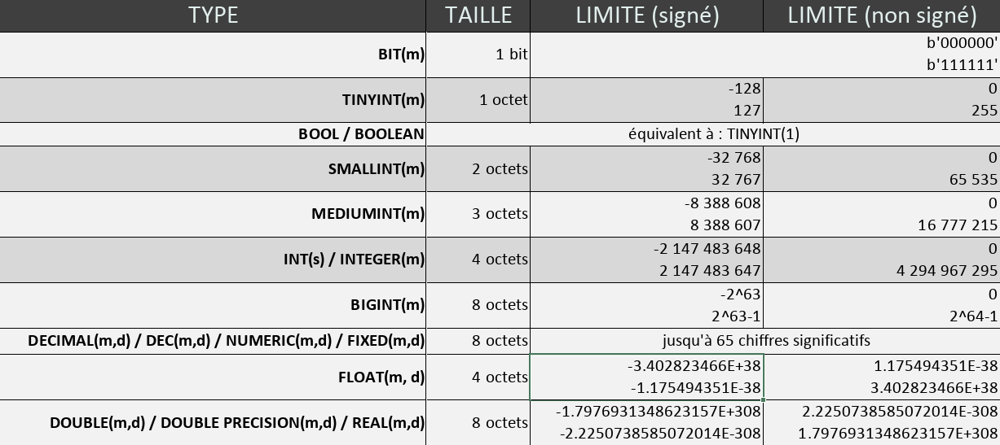

# [6. Tables et données](https://www.youtube.com/watch?v=Y_y-RNZApmk)
19-12-2020

Bonjour vous êtes sur la formation SQL et on continue avec cette 6e vidéo pour parler des tables et des données liées à ces tables.

Précédemment on avait vu comment créer une base de données très simplement avec quelques commandes. 

Maintenant que nous avons notre base de données, nous allons voir comment intégrer des données à l'intérieur. 

Alors qu'est-ce qu'on entend par table ? parce qu'il s'agit du thème de cette vidéo. 

Alors une table va être présentée un petit peu comme sous forme d'une boîte d'accord qui va contenir nos informations. 
```txt
	+---------------------------+
	| matable					|
	+---------------------------+
	| champ1<TYPE><CONTRAINTES>	|-------------
	| champ2<TYPE><CONTRAINTES>	|
----| champ3<TYPE><CONTRAINTES>	|
	|			etc...			|
	|							|-------------
	+---------------------------+
```
La table va être présentée comme une sorte de boîte qui va contenir nos informations, elle va avoir un nom "matable" on va pouvoir la nommer. 

Ensuite elle va contenir un certain nombre de champs. 

Ces différents champs auront également un nom pour pouvoir les identifier. 

Ils auront également un type pour savoir quel type de données ils vont stocker. 

Ils ont éventuellement des contraintes. 

On verra par la suite, on fera une vidéo spécifique dédiée aux contraintes d'une table d'accord au niveau des contraintes de colonne ou de champ. 

On parle de colonnes ou de champs ici. 

Notre table pourra également être reliée à d'autres tables SQL : `----------------`. On peut avoir d'autres liaisons et c'est pour ça qu'on parle de SGBD relationnel parce qu'il y a des relations entre les tables mais on peut très bien aussi avoir une table qui serait isolée du reste. 

On peut avoir par exemple une table de paramètres qui serait isolée, il serait indépendant du reste de tout l'ensemble de notre base de données. 

Voilà ce que vous allez apprendre à faire dans cette vidéo là c'est-à-dire à créer une table avec différents champs et différentes données donc on va s'occuper de ça. 

On va créer un fichier SQL, code.sql, sur lequel on pourra écrire les requêtes et après on n'aura plus qu'a copier coller au niveau du client. 

+ code.sql
```sql

```

D'ailleurs je vais me connecter sur le client comme ça ce sera fait.
```powershell
	>mysqld --console
	2020-12-19T12:34:12.062094Z 0 [System] [MY-010116] [Server] C:\Users\sam\OneDrive\Formations\FormationVideo\MyWAMP\mysql\bin\mysqld.exe (mysqld 8.0.22) starting as process 4828
	2020-12-19T12:34:12.193893Z 1 [System] [MY-013576] [InnoDB] InnoDB initialization has started.
	2020-12-19T12:34:13.775555Z 1 [System] [MY-013577] [InnoDB] InnoDB initialization has ended.
	2020-12-19T12:34:47.545262Z 0 [System] [MY-011323] [Server] X Plugin ready for connections. Bind-address: '::' port: 33060
	2020-12-19T12:34:47.811272Z 0 [Warning] [MY-010068] [Server] CA certificate ca.pem is self signed.
	2020-12-19T12:34:47.812240Z 0 [System] [MY-013602] [Server] Channel mysql_main configured to support TLS. Encrypted connections are now supported for this channel.
	2020-12-19T12:34:47.951374Z 0 [System] [MY-010931] [Server] C:\Users\sam\OneDrive\Formations\FormationVideo\MyWAMP\mysql\bin\mysqld.exe: ready for connections. Version: '8.0.22'  socket: ''  port: 3306  MySQL Community Server - GPL.
```
	> mysql -u root -p
	Enter password:
	Welcome to the MySQL monitor.  Commands end with ; or \g.
	Your MySQL connection id is 8
	Server version: 8.0.22 MySQL Community Server - GPL

	Copyright (c) 2000, 2020, Oracle and/or its affiliates. All rights reserved.

	Oracle is a registered trademark of Oracle Corporation and/or its
	affiliates. Other names may be trademarks of their respective
	owners.

	Type 'help;' or '\h' for help. Type '\c' to clear the current input statement.

	mysql>
```
Voilà normalement c'est okay. 

Alors jusqu à présent je vous ai montré qu'on pouvait afficher une base de données donc je vais faire quelques petits rappels très très rapide.

+ code.sql
```sql
	SHOW DATABASES;
```
show databases c'est pour afficher nos bases de données donc logiquement sur MySQL par défaut, vous devriez avoir ça.
```sql
	> show databases;
	+--------------------+
	| Database           |
	+--------------------+
	| information_schema |
	| mysql              |
	| performance_schema |
	| sys                |
	+--------------------+
	4 rows in set (0.01 sec)
```
Vous aurez évidemment d'autres bases de données si vous êtes sur un autre système de gestion donc ça c'est à vous de voir. 

Alors sur le fichier je vais en parler très rapidement vous pouvez mettre des commentaires parce qu'ici voyez on est sur un fichier vraiment en SQL, on peut écrire des commentaires. 

Je vais d'ailleurs faire une petite parenthèse. 

Pour les commentaires en SQL, vous avez d'abord le double trait -- d'accord le double tiret. C'est un commentaire sur une seule ligne. Vous avez également le dièse alors par contre sur Visual Studio code il ne gère pas là coloration pour le dièse mais je ne sais pas pourquoi comme s'il le considérait pas comme étant un commentaire mais sachez que ça fonctionne également. Personnellement j'utilise tout le temps le double tiret donc ce n'est pas bien grave. Et vous avez ensuite le commentaire sur plusieurs lignes / * * /, le fameux commentaire en c tel que l'on connaît bien donc évidemment pas de surprise pour ceux qui font quelques langages de programmation car ça c'est un type de commentaire que vous connaissez bien en informatique.

+ code.sql
```sql	
	-- 	Commentaire sur une seule ligne
	# 	Commentaire sur une seule ligne
	
	/ * Commentaire sur plusieurs 
	lignes * /
	
	SHOW DATABASES;
```
Alors vous pouvez comme ça marqué ces 2 là et ce sera efficace, -- et / ** /.

+ code.sql
```sql	
	-- Requêtes sur les bases de données
	SHOW DATABASES;
```
On a donc show databases comme on vient de le faire.

Nous allons créer une base de données qu'on va appeler test mais vous avez vu aussi qu'on pouvait faire un petit test pour voir si notre base de données n'existait pas déjà en faisant IF NOT EXISTS. 

+ code.sql
```sql	
	-- Requêtes sur les bases de données
	SHOW DATABASES;
	CREATE DATABASE IF NOT EXISTS test;
```
Alors ce que je vous avais pas dit précédemment et qui va être important ici c'est au niveau de tout ce qui est nommage et ce qui fait appel au nom d'une base de données, Quand on verra plus tard le nom d'une table ou le nom d'un de ces champs, il recommandé d'utiliser des anti quote le symbole que vous allez faire avec la touche alt gr + µ qui va vous donner ce symbole ici `. 

Alors pourquoi doit ton faire ceci ?

+ code.sql
```sql	
	-- Requêtes sur les bases de données
	SHOW DATABASES;
	CREATE DATABASE IF NOT EXISTS `test`;
```
Tout simplement parce que c'est un jour j'appelle même si ce n'est pas une bonne idée, ma base de données database parce que vous voyez il va le considérer comme un mot-clé (voyez la coloration syntaxique).
```sql
	CREATE DATABASE IF NOT EXISTS /!\database/!\ `test`;
```
Et du coup en général les éditeurs de texte vont le colorer pour pouvoir l'indiquer et du coup il ne sera pas si ça correspond à un nommage ou si ça correspond à un mot-clé c'est à dire un mot réservé en SQL au niveau de votre requête. 

Pour éviter ce genre de problème, on prend l'habitude pour tout ce qui est nommage de quelque chose d'utiliser ce symbole c'est-à-dire le fameux anti quote ` ` pour entourer les noms pour éviter les problèmes. 

Si je vous ne l'avais pas dit dans la vidéo précédente pour ne pas trop surcharger la vidéo mais à partir de maintenant prenez cette habitude là de bien entourer comme ça avec ces anti quotes. 

Voilà ce sont les petites quotes qui sont penchées vers la gauche. 

Voilà c'est bien le alt gr et la touche µ. 

Je vais donc pouvoir lancer la requête tout simplement.
```sql
	> CREATE DATABASE IF NOT EXISTS `test`;
	Query OK, 1 row affected (0.01 sec)
```
Et ensuite on peut refaire un SHOW DATABASES pour voir qu'on a bien créé une nouvelle base de données.
```sql
	> show databases;
	+--------------------+
	| Database           |
	+--------------------+
	| information_schema |
	| mysql              |
	| performance_schema |
	| sys                |
	| test               |
	+--------------------+
	5 rows in set (0.00 sec)
```
Voyez qu'on a bien test qui est là. 

Ensuite il ne reste plus qu'a faire un USE de la base de données en question pour dire que j'utilise cette base de donnée. 

+ code.sql
```sql
	-- Requêtes sur les bases de données
	SHOW DATABASES;
	CREATE DATABASE IF NOT EXISTS `test`;
	USE `test`;

	> USE `test`;
	Database changed
```
Voilà et là ça vous met Database changed donc on a bien le changement qui est fait là. 

Comme pour la commande ici SHOW pour afficher, lister nos bases de données, nous allons avoir une commande également pour les tables. 

+ code.sql
```sql
	-- Requêtes sur les bases de données
	SHOW DATABASES;
	CREATE DATABASE IF NOT EXISTS `test`;
	USE `test`;
	
	-- Requêtes liées aux tables
	SHOW TABLES;
```
Voyez que c'est très simple au niveau de la syntaxe SQL, il n'y a vraiment pas de complication et donc là on a empty set parce que nous avons créé aucune table pour le moment.
```sql
	> SHOW TABLES;
	Empty set (0.01 sec)
```
Si on n'avait pas fait de USE avant c'est-à-dire que si on n'était pas sur la table test, il aurait fallu simplement rajouter ceci.

+ code.sql
```sql
	-- Requêtes sur les bases de données
	SHOW DATABASES;
	CREATE DATABASE IF NOT EXISTS `test`;
	USE `test`;
	
	-- Requêtes liées aux tables
>	SHOW TABLES FROM `test`;
```
C'est pour ça que je vous dis que c'est très simple au niveau de la syntaxe, au niveau des requêttes. 

On dit d'afficher toutes les tables depuis donc FROM la base de données test d'accord on peut faire comme ça mais si on est déjà en train d'utiliser la base de données test, on a évidemment pas besoin de le spécifier parce qu'il le sait. 

Il sait qu'en faisant juste ça SHOW TABLES; il doit le faire sur la table courante donc n'hésitez pas comme ça à compléter à chaque fois vos requêtes en fonction. 

Maintenant qu'on a ça on va voir comment créer notre table SQL très simplement et vous allez voir que la commande n'est pas compliquée à apprendre.

C'est très logique, c'est toujours un peu les mêmes termes SHOW CREATE et cetera alors certains termes peuvent varier si vous êtes sur un autre système de base de données mais pour tout ce qui est SQL standard, l'SQL qui fonctionne de manière générale partout pareil et bien les commandes sont très faciles à retenir. 

Comme nous avions le CREATE DATABASE, on peut faire tout simplement un CREATE TABLE et on va lui donner un nom donc t_users avec un t pour test ou table comme vous voulez. 

+ code.sql
```sql
	-- Requêtes sur les bases de données
	SHOW DATABASES;
	CREATE DATABASE IF NOT EXISTS `test`;
	USE `test`;
	
	-- Requêtes liées aux tables
	SHOW TABLES;
	
	CREATE TABLE `t_users`
```
Voilà je mets donc un t underscore user donc pas d'accent, pas d'espace c'est-à-dire que vous pouvez mettre des underscores pour spécifier des espaces. 

Vous pouvez également écrire camelCase où on met une majuscule à chaque début de mot pour ceux qui connaissent, tUsers. 

Et cetera, et cetera.

Essayer de prendre un nom comme ça qui sont suffisamment explicites et qui ne sont pas avec des caractères bizarres. 

Alors selon les systèmes, les noms sont sensibles à la case c'est-à-dire que marquer une table comme ça t_users ne sera pas forcément la même chose que de la marquer comme ça t_USERS en fonction des systèmes. Vous en avez qui sont sensibles et d'autres non donc le mieux c'est vraiment de choisir le nom que vous voulez mais en général une table on va plutôt l'écrire en minuscule par habitude et il n'y aura pas de problème. 

Comme pour CREATE DATABASE, on peut très bien aussi dire ceci IF NOT EXISTS.

+ code.sql
```sql
	-- Requêtes sur les bases de données
	SHOW DATABASES;
	CREATE DATABASE IF NOT EXISTS `test`;
	USE `test`;
	
	-- Requêtes liées aux tables
	SHOW TABLES;
	
>	CREATE TABLE IF NOT EXISTS `t_users`
```
De dire voilà tu crées la table t_users si elle n'existe pas déjà parce qu'on va pas essayer de créer une table qui existerait déjà ça amènerait des erreurs donc on peut évidemment rajouter ceci IF NOT EXISTS mais moi comme je sais qu'il n'y a rien, je ne vais pas le mettre mais vous pouvez le faire. 

Alors nous allons ouvrir des parenthèses, il y aura des parenthèses de fin et le fameux ; pour terminer la requête.

+ code.sql
```sql
	-- Requêtes sur les bases de données
	SHOW DATABASES;
	CREATE DATABASE IF NOT EXISTS `test`;
	USE `test`;
	
	-- Requêtes liées aux tables
	SHOW TABLES;
	
	CREATE TABLE `t_users`
	(
	
	);
```
À l'intérieur des parenthèses nous allons pouvoir enregistrer les différents champs. 

Moi je vais pouvoir faire quelque chose de très simple c'est-à-dire que je vais leur donner un nom, je vais avoir l'identifiant de user, `id_user` suivi d'un type INT mais on va en parler juste après et on va s'arrêter là pour ne pas faire trop compliqué pour le moment. Ensuite nous allons avoir `user_name` VARCHAR(65) mais j'en parlerais aussi après. Et ensuite on va avoir `user_birthday` DATE et ce sera bon.

+ code.sql
```sql
	-- Requêtes sur les bases de données
	SHOW DATABASES;
	CREATE DATABASE IF NOT EXISTS `test`;
	USE `test`;
	
	-- Requêtes liées aux tables
	SHOW TABLES;
	
	CREATE TABLE `t_users`
	(
		`id_user` INT,
		`user_name` VARCHAR(65),
		`user_birthday` DATE
	);
```
Voyez un petit peu le nommage que je fais parce que je n'ai pas choisi au hasard, c'est le nommage que je vous recommande si vous ne savez pas par exemple comment nommer les champs d'une table ou même une table. 

Vous spécifiez un préfixe à vos table `t_...` que vous choisissez. Celui que vous voulez, ça peut être votre nom de famille, ça peut être le nom de votre site, ça peut être des initiales enfin bref tout ce que vous voulez, un préfixe que vous choisissez, un underscore suivi du nom correspondant à la table comme ça vous savez à quoi ça correspond, users.

Et au niveau des champs, vous voyez que pour l'identifiant `id_users` qui sera très important notamment pour les index ou tout ce qui est comptage mais on en parlera plus tard, vous pouvez commencer par id underscore et le nom de la table où vous voyez que c'est au singulier et pas au pluriel, user. 

Et ensuite pour les autres champs `user_name`, `user_birthday`, j'ai l'habitude de mettre le nom de la table underscore et le nom du champ, pourquoi ?

Parce que c'est plus tard on a plusieurs tables différentes qui aurait un attribut `name` c'est-à-dire qu'on va éviter de faire ça quand on pourrait le voir des fois  `id`, `name`, `birthday` parce que si un jour vous avez une autre table qui a un champ `name` et bien ça pourrait prêter à confusion même au niveau de la lecture de vos requêtes SQL, ça pourrait compliquer les choses parce qu'on ne saura pas à quoi correspond `name`. 

Par contre en ayant le nom de la table dans le nom du champ `user_name`, Eh bien tout de suite on sait à quoi il fait référence, c'est beaucoup plus simple je trouve de fonctionner comme ça. 

Après vous êtes libre, il n'y a pas de règles précises, il n'y a pas de convention obligatoire, c'est comme pour le reste, en informatique, en convention de codage, en convention de nommage et cetera, c'est à vous de choisir mais une fois que vous avez choisi un système lorsque je l'avais déjà expliqué dans une précédente vidéo sur les petits conseils que je vous avais donné pour le codage. 

Une fois que vous avez choisi certaines règles, certaines conventions, il faut le faire jusqu'au bout pour ne pas que ça mélange pour que ça reste homogène et que ça ne mélange pas les différentes syntaxes. 

On va donc faire ça comme ça, copier coller.
```sql
	> CREATE TABLE `t_users`
		-> (
		-> `id_user` INT,
		-> `user_name` VARCHAR(65),
		-> `user_birthday` DATE
		-> );
	Query OK, 0 rows affected (0.05 sec)
```
Voilà Query OK et là on peut du coup refaire un show tables.
```sql
	> show tables;
	+----------------+
	| Tables_in_test |
	+----------------+
	| t_users        |
	+----------------+
	1 row in set (0.00 sec)
```
Et on voit que ça à afficher la table t_users. 

Alors il y a également la possibilité d'afficher toutes les informations donc le détail d'une table. 

Pour cela vous avez la commande et je vais le noter ici d'ailleurs DESCRIBE et le nom de la table donc moi ça va être t_users.

+ code.sql
```sql
	-- Requêtes sur les bases de données
	SHOW DATABASES;
	CREATE DATABASE IF NOT EXISTS `test`;
	USE `test`;
	
	-- Requêtes liées aux tables
	SHOW TABLES;
	
	CREATE TABLE `t_users`
	(
		`id_user` INT,
		`user_name` VARCHAR(65),
		`user_birthday` DATE
	);

	DESCRIBE `t_users`; -- EXPLAIN / DESC
```
Alors DESCRIBE peut-être également EXPLAIN alors ça ce sont des alias c'est-à-dire que vous pouvez utiliser le mot EXPLAIN ou vous pouvez utiliser DESC qui est le diminutif de DESCRIBE. 

Moi j'utilise souvent DESCRIBE mais vous pouvez utiliser l'un ou l'autre également d'accord et ça fonctionnera aussi. 

On va donc faire ça et là regardez.
```sql
	> DESCRIBE `t_users`;
	+---------------+-------------+------+-----+---------+-------+
	| Field         | Type        | Null | Key | Default | Extra |
	+---------------+-------------+------+-----+---------+-------+
	| id_user       | int         | YES  |     | NULL    |       |
	| user_name     | varchar(65) | YES  |     | NULL    |       |
	| user_birthday | date        | YES  |     | NULL    |       |
	+---------------+-------------+------+-----+---------+-------+
```
On obtient toutes les informations que j'ai noté donc on a FIELD qui est le champ ce qu'on appelle la colonne de la table. 

On va avoir le type et là vous voyez qu'il m'a mis INT(11) alors que moi j'avais mis INT mais on va l'expliquer pourquoi. 

Et on voit qu'on a également une colonne Null, Key, Default et Extra, on verra un petit peu à quoi ça correspond ça concerne notamment tout ce qui s'appelle les contraintes mais les contraintes on en parlera dans une prochaine vidéo parce que je ne voulais pas te mélanger puisqu'il va s'agir de vidéos assez longue pour le coup en ce qui concerne les tables et les contraintes. 

Voilà plutôt que de faire tout ça dans une seule vidéo je vous l'ai séparé en 2 vidéos faut que ce soit plus pratique pour vous. 

On va donc il sait qu'il nous a mis 3 lignes, 3 champs pour la table t_users comme ça on a toutes ces informations là. 

Alors je vous ai dit qu'il y avait des types, il faut savoir qu'ils ne sortent pas de nulle part. 

Il y a des types particuliers et ça va être là tout l'intérêt en SQL de bien les choisir c'est à dire que souvent et notamment les débutants ou même des fois des gens qui ont pas mal d'expérience ne choisissent pas forcément les types adéquats selon les informations à stocker. 

Le principe en SQL c'est de toujours essayer de stocker, d'utiliser le type le plus limitant possible c'est-à-dire que par exemple si vous voulez stocker un nombre, n'importe quoi comme nombre, un nombre quelconque où vous savez que ce nombre ne va jamais déplacer 99 ça ne servirait à rien de dire que pour le champ qui va stocker maximum le nombre 99, on le met dans un champ qui sera de type qui peux accepter des nombres jusqu à par exemple 9999999 parce que ce serait forcément pas optimisé dans certains cas. 

En effet ici vous allez utiliser un nombre qui va prendre plus de octets en mémoire alors que vous auriez pu prendre un type beaucoup plus léger en espace mémoire pour stocker maximum le nombre 99 c'est-à-dire de 0 à 99 par exemple. 

Ça ça va être important et c'est ce qui risque d'être un petit peu là complication au niveau SQL, ça va être de dire que pour tel type de données, pour tel champ, quel type vais-je utiliser ? Quel sera le plus optimal ? Quel sera le plus efficace ? 

Alors je vous ai fait un tableau que vous pourrez récupérer dans la description de la vidéo parce qu'il y a pas mal de tableaux qui sont déjà faits pour les différents types de données.

Alors on va les regrouper en 3 types, on a les types concernant les chaînes de caractère, on a les types concernant les dates et les types concernant tout ce qui est numérique. 

On va donc voir un petit peu tout ça. 

On va commencer à parler sur tout ce qui concerne le numérique et vous allez voir qu'il y en a pas mal.


<!--
+---------------------------------------+-----------+---------------------------+-----------------------+
| TYPE									| TAILLE	| Limite (signé)			| LIMITE (non signé)	|
+---------------------------------------+-----------+---------------------------+-----------------------+
| BIT(m)								| 1 bit		|							  b'000000'				|
|										|			| 							  b'111111'				|
| TINYINT(m)							| 1 octet	| -128						| 0						|
|										|			|  127						| 255					|
| BOOL / BOOLEAN						| 						équivalent à TINYINT(1)					|
| SMALLINT(m)							| 2 octets	| -32 768					| 0						|
|										|			|  32 767					| 65 535				|
| MEDIUMINT(m)							| 3 octets	| -8 388 608				| 0						|
|										|			|  8 388 607				| 16 777 215			|
| INT(s) / INTEGER(m)					| 4 octets	| -2 147 483 648			| 0						|
|										|			|  2 147 483 647			| 4 294 967 295			|
| BIGINT(m)								| 8 octets	| -2^63						| 0						|
|										|			|  2^63-1					| 2^64-1				|
| DECIMAL (m,d / DEC(m,d) / 			| 8 octets	| Jusqu'à 65 chiffres significatifs					|
| NUMERIC(m,d) / FIXED(m,d)				|			|													|
| FLOAT(m,d)							| 4 octets	| -3.402823466E+38			| 1.175494351E-38		|
|										|			| -1.175494351E-38			| 3.402823466E+38		|
| DOUBLE(m,d) / DOUBLE PRECISION(m,d) 	| 8 octets	| -1.7976931348623157E+308	| 2.2250738585072014E-308
| / REAL(m,d)							|			| -2.2250738585072014E-308	| 1.7976931348623157E+308
+---------------------------------------+-----------+---------------------------+-----------------------+
-->
Voilà il y en a pas mal, il y en a plein qui vont vous servir, il y en a plein dont vous n'utiliserez peut-être jamais mais je vous ai mis vraiment ceux qui avaient un intérêt, ceux qui étaient significatifs et qui pouvaient servir. 

Je vais aller très vite dessus parce que ces tableaux-là vous pouvez les récupérer en téléchargement dans la description de la vidéo donc je ne vais pas trop m'attarder dessus. 

Grosso modo je vous ai mis le nom du type, je vous ai mis la place qu'il prend en mémoire donc ici en nombre d'octets ou de bits pour le coup notamment pour le type BIT. Et je vous ai mis sa limite. 

Alors je rappelle pour ceux éventuellement qui n'auraient pas fait de programmation qu'on parle de nombres signés quand il peut être négatif ou positif, ce qu'on appelle en mathématique un nombre arithmétique. 

Alors qu'est-ce que un nombre arithmétique ? C'est un nombre qui peut être positif ou négatif d'accord. 

Tandis qu'un nombre qui n'est pas arithmétique, c'est un nombre qui ne peut être que positif. 

C'est un petit peu la valeur absolue mais en informatique on parle de nombres non signés, de valeurs non signées donc c'est une valeur qui sera forcément positive. 

Vous voyez qu'en fonction, ils peuvent accueillir certaines choses (colonne limite). 

Alors le BIT est utilisé pour des valeurs binaires tout simplement. 

On va avoir le TINYINT qui va occuper un octet qui pourra soit être un nombre compris entre -128 et 127, ou en version non signée entre 0 et 255 donc c'est par exemple je voulais stocker un nombre c'est-à-dire le fameux 99 de tout à l'heure, Eh bien ce serait ici un bon choix de type. Ce sera un bon choix d'utiliser TINYINT parce qu'on voit de toute façon qu'on ne pourra jamais aller plus loin que 127 ou plus loin que 255 en non signé. 

Dans ce cas-ci ça ne sert à rien de commencer à prendre le MEDIUMINT où lui on voit qui peut aller jusqu à 16 millions ou 8 millions en signé. Ça n'aurait aucun intérêt en plus vous voyez qu'il stocke, ils occupent 3 octets en mémoire alors que le TINYINT n'occupe qu'un octet en mémoire donc ici on perdrait 2 octets inutilement pour stocker ce fameux nombre 99 comme je vous l'ai montré tout à l'heure. 

Donc en fonction vous pouvez voir comme ça différents types en fonction de ce que vous voulez. 

Le tableau est pour moi suffisamment explicite par rapport à tout ce que je vous ai noté. 

Alors petite remarque pour le booléen, c'est tout simplement un TINYINT(1) de 1 mais pourquoi ?

Là vous voyez que j'ai mis un (m) entre parenthèses parce qu'il correspond à un paramètre c'est-à-dire que si je remplace m par 1, ça veut dire que le nombre ici entier ne sera composée que d'un seul chiffre.

Si je met m=2, il pourra avoir 2 chiffres c'est-à-dire jusqu à 99 et si je met m=3 il pourra aller jusqu à 999 mais ici en l'occurrence il ne pourra aller que jusqu à 127 parce que c'est la limite signé avec TINYINT.

Et cetera et cetera. 

Vous pouvez comme ça choisir une limite en mettant entre parenthèses. 

Alors ce n'est pas obligatoire parce que vous voyez ici que pour le INT je ne l'ai pas fait. 
```sql
	CREATE TABLE `t_users`
	(
>		`id_user` INT,
		`user_name` VARCHAR(65),
		`user_birthday` DATE
	);
```
À ce moment-là c'est MySQL qui va déterminer une taille par défaut qui est d'ailleurs pas forcément la plus optimale parce que là vous verrez que pour id_user en fait l'identifiant je peux considérer si je réfléchi sur cette table là .. un d'identifiant d'utilisateur est quelque chose qui sera unique c'est à dire que ce sera un numéro d'utilisateur. On peut partir du principe que le premier va commencer à 1 et le dernier atteindra le nombre d'utilisateurs de votre site. 

De manière générale on pourrait se dire que pour commencer quand je crée un site par exemple, je ne m'attends pas à voir 15 mais l'utilisateur pour commencer parce que c'est un nombre qui va évoluer au fil du temps et comme on va pouvoir changer les types. Vous verrez qu'on va pouvoir changer le type d'un champ de table sans problème c'est-à-dire qu'on pourra passer un type petit vers un type plus grand n'importe quand d'ailleurs youtube l'a fait il n'y a pas longtemps pour son compteur de vues sur des vidéos pour ceux qui avaient suivi. 

Eh bien on pourra modifier ce type donc moi je pourrais partir du principe déjà avant d'avoir 65535 utilisateurs différents sur un site, il faut quand même pas mal d'utilisateurs donc on pourrait utiliser le fameux SMALLINT() tout simplement. 

Et SMALLINT, on pourrait du coup le spécifier ici.

+ code.sql
```sql
	-- Requêtes sur les bases de données
	SHOW DATABASES;
	CREATE DATABASE IF NOT EXISTS `test`;
	USE `test`;
	
	-- Requêtes liées aux tables
	SHOW TABLES;
	
	CREATE TABLE `t_users`
	(
>		`id_user` SMALLINT,
		`user_name` VARCHAR(65),
		`user_birthday` DATE
	);

	DESCRIBE `t_users`; -- EXPLAIN / DESC
```
Ça fait qu'on aura pour id_user beaucoup moins d'espace utilisé en mémoire que le fameux INT parce que vous voyez que INT occupe 4 octets donc on a économisé 2 octets donc on a réduit de moitié la place en mémoire pour ce champ là. 

Ça ne paraît pas grand-chose qu'on parle de simple côté mais partez du principe et sachez qu'une base de données elle peut faire plusieurs terra, plusieurs giga-octets d'espaces parce que ça va contenir des millions et des millions d'enregistrements c'est-à-dire que je parle de bases de données réelles pour des cas réel on a énormément de données donc le moindre octet qui peut être gagné est important. 

Ici vous multiplier par 2 octets par le nombre d'enregistrements et là on arrive sur des kilos giga méga octets de données donc ce n'est pas rien. 

C'est ici 2 octets pour un seul enregistrement pour juste l'identifiant c ensuite vous ajoutez tous les autres champs fois le nombre de user que vous aurez c'est-à-dire le nombre d'utilisateurs, et bien on peut se retrouver avec détails assez énormissime donc c'est à prendre en compte. 

Pour le cloud on voit que c'est plus intéressant de faire SMALLINT et puis si un jour j'atteins les 65435 utilisateurs et même si on atteint 60000 utilisateurs, en bon programmeur que nous sommes on va transformer c'est-à-dire qu'on va altérer la table mais ça on le verra après en modifiant le type SMALLINT en par exemple MEDIUMINT et cetera.

+ code.sql
```sql
	-- Requêtes sur les bases de données
	SHOW DATABASES;
	CREATE DATABASE IF NOT EXISTS `test`;
	USE `test`;
	
	-- Requêtes liées aux tables
	SHOW TABLES;
	
	CREATE TABLE `t_users`
	(
>		`id_user` MEDIUMINT,
		`user_name` VARCHAR(65),
		`user_birthday` DATE
	);

	DESCRIBE `t_users`; -- EXPLAIN / DESC
```
Voilà on va faire ça au fur et à mesure et ainsi de suite jusqu à éventuellement aller loin loin loin. 

Ça ne sert à rien dès le départ de se dire qu'on est en très grand nombre BIGINT pour parer à l'éventualité du nombre d'utilisateurs qu'il pourrait y avoir parce que avant d'arriver déjà à la taille d'un BIGINT et je rappelle que c'est 2^64-1 donc c'est un très grand nombre et qui est en plus stocké sur 8 octets donc ça prend beaucoup de place. 

Vous avez donc le temps de voir venir, je ne suis pas sûr que ça existe un site avec un nombre d'utilisateurs qui est stocké sur un BIGINT honnêtement. 

Envoyer des gens que le simple INT ça peut déjà aller jusqu à plus de 4 milliards donc déjà quand vous avez plus de 4 milliards d'utilisateurs sur un site web c'est pas mal !

logiquement déjà avant d'en arriver à du BIGINT, il faut déjà un sacré site web, une sacrée infrastructure. 

Vraiment choisi c'est donc toujours le bon type en fonction. 

Au départ vous allez sûrement vous tromper vous n'avez pas utilisé les types adéquats et ça ce n'est pas grave. 

Par contre prenez très vite cette habitude là parce que après ça me permettra de toujours travailler de cette manière, de toujours choisir le type en question le plus efficace par rapport à l'information que vous avez. 

Pour continuer même si je vais essayer de pas perdre trop de temps sinon là pour le coup la vidéo sera un petit peu long parce qu'il y a beaucoup de choses à dire. 

Nous avons ensuite les types liés aux chaînes de caractères.


<!--
+---------------------------+---------------+-----------------------------------+
| TYPE						| TAILLE		| LIMITE							|
+---------------------------+---------------+-----------------------------------+
| CHAR(m) / BINARY(m)		| m				| 255 caractères / octets			|
| VARCHAR(m) / VARBINARY(m)	| m+1			| 255 caractères / octets			|
| TINYTEXT / TINYBLOB		| m+1			| 255 caractères / octets			|
| TEXT(m) / BLOB(m)			| m+2			| 65 535 caractères / octets		|
| MEDIUMTEXT / MEDIUMBLOB	| m+3			| 16 777 215 caractères / octets	|
| LONGTEXT / LONGBLOB		| m+4			| 4 294 967 296 caractères / octets	|
| SET						| 1,2,3,4 ou 8	| 8, 16, 24, 32 ou 64 choix			|
| ENUM						| 1 ou 2		| 255 ou 65 535 choix				|
+---------------------------+---------------+-----------------------------------+
-->
Alors les chaînes de caractères c'est tout ce qui va pas servir de calcul. 

Dès qu'on n'a pas besoin de faire de calcul ou qu'on va par exemple stocker un nombre sur lequel on n'a pas besoin de faire de calcul, je pense par exemple à un code postal ou ce genre de chose, on peut par exemple utiliser ça où stocké sous forme de chaîne ou alors un nom, une adresse ou n'importe quoi. 

Vous avez le fameux cas ou alors son alias Binary … Ce n'est pas vraiment un alias, c'est que dans le tableau la colonne TYPE contient à gauche l'équivalent en mode texte et à droite l'équivalent en mode binaire c'est à dire stocké sous forme d'octets. 

Le CHAR(m) par exemple va permettre d'avoir jusqu à 255 caractères et il occupera du coup la taille en fonction du nombre de caractères que vous avez spécifié (m) OK donc voyez par rapport à ça. 

m est en fonction du nombre de caractères que vous avez.

Si vous utilisez BINARY(m) ce sera stocké sous forme d'octets et non pas de caractères.

Voyez qu'il y a un mode texte, un mode binaire et cetera.

Je vous ai mis les 2 ensemble comme ça au niveau des tailles ça correspond et au niveau des limites c'est la même chose, c'est juste la manière dont la donnée est stockée qui changes soit on parle de caractères soit on parle de octets. 

Nous avons ensuite des types très particuliers qui sont le SET et le ENUM, c'est tout simplement la possibilité de stocker une liste d'information avec possibilité par exemple de choisir l'une des choses ou alors d'avoir plusieurs valeurs selon le cas où nous aurons le SET ou l'ENUM ce genre de chose donc c'est aussi très important. 

De toute façon, rassurez vous on aura l'occasion d'utiliser d'employer différents types de données et c'est pour ça que je vais assez vite là dessus mais on va travailler dessus par la suite donc si vous ne savez pas comment vous servir de SET, ENUM d'ailleurs dans la base de donnees que je vous passerais je vais essayer d'utiliser un maximum de types différents en fait ou en tout cas des types qui sont assez variés pour que vous voyiez ça. 

Rappelez-vous je vous avais dit que je vous donnerais un fichier SQL pour qu'on puisse travailler tous sur les mêmes informations donc si vous ne savez pas comment écrire une énumération au niveau de la création de tables de toute façon on le verra. 

Voyez donc qui sait en fonction du nombre de choix que vous voulez différents, si par exemple on voulait faire un ENUM de … alors ENUM ça va être l'un ou l'autre donc ça peut être par exemple est-ce qu'un utilisateur est abonné ? Admettons que vous voudriez dire ça en utilisateur donc ici.

+ code.sql
```sql
	-- Requêtes sur les bases de données
	SHOW DATABASES;
	CREATE DATABASE IF NOT EXISTS `test`;
	USE `test`;
	
	-- Requêtes liées aux tables
	SHOW TABLES;
	
	CREATE TABLE `t_users`
	(
		`id_user` MEDIUMINT,
		`user_name` VARCHAR(65),
		`user_birthday` DATE,
		`user_is_subscriber` ENUM(`N`, `Y`)
	);

	DESCRIBE `t_users`; -- EXPLAIN / DESC
```
On aura donc par exemple différents champs dans ENUM(`N`, `Y`) avec N pour no et Y pour yes.

Voilà on peut faire ce genre de chose et ça je voulais montrer très rapidement.

Eh bien on peut le définir comme ça c'est à dire que ça pourra être soit oui soit non, ce soir il est abonné soit il ne l'est pas car il ne peut pas être l'un et l'autre en même temps. 

Pour le SET, on pourra par contre définir plusieurs valeurs où on peut choisir en fait, c'est du choix multiple tandis que l'autre est un choix unique d'accord c'est un parmi la liste. 

Et vous voyez qu'en fonction du nombre de choix que vous voulez c'est-à-dire que là par exemple pour une énumération, on peut définir jusqu à 65535 choix différents donc à priori vous avez de la marge au niveau de la limite. 

Et pour le SET, on a jusqu à 64 choix. 

Évidemment en fonction du nombre de choix que vous avez mis ça prendra une certaine place en mémoire voilà ça c'est à voir aussi donc à prendre en compte. 

Alors le SET prend évidemment plus de place puisqu'il peut y avoir des choix multiples, il faut pouvoir stocker toutes ces informations en mémoire pour savoir tous les choix qui ont pu être pris tandis que l'énumération ce n'est que un ou l'autre donc on a juste besoin de choisir parmi l'un des choix disponibles. 

On a donc moins d'informations à stocker en toute logique pour l'énumération.

Voilà pour les types donc tout ce qui est charactère.

Et on a ensuite tout ce qui concerne les dates.


<!--
+-----------+-----------+-----------------------+
| TYPE		| TAILLE	| LIMITE				|
+-----------+-----------+-----------------------+
| DATE		| 3 octets	| 1000-01-01			|
|			|			| 9999-12-31			|
| TIME		| 3 octets	| 00:00:00				|
|			|			| 23:59:59				|
| DATETIME	| 8 octets	| 1000-01-01 00:00:00	|
|			|			| 9999-12-31 23:59:59	|
| YEAR		| 1 octet	| 1901					|
|			|			| 2155					|
| TIMESTAMP	| 4 octets	| 19700101000000		|
|			|			| 20380119031407		|
+-----------+-----------+-----------------------+
-->
Et on a ensuite tout ce qui concerne les dates. 

Je vais aller très vite aussi, je vous ai le format je pense que c'est parlant, la première date c'est la date minimale qu'on peut avoir la 2e c'est la date maximale logique. 

Ensuite on a pour le temps, et encore ensuite on a les 2 à la fois si vous voulez à la fois la date et l'heure complète. 

Vous avez juste l'année si vous voulez stocker une année, on va utiliser YEAR ça paraît logique. 

Et si on veut le timestamp pour ceux qui connaissent et si vous ne connaissez pas je vais vous l'expliquer.

TIMESTAMP c'est ce qui date en fait depuis l'époque Unix donc le Unix Epoque, qui est en fait le temps qui s'est écoulé depuis le 1/1/1970 avec notamment les systèmes de la famille Unix qui sont arrivés il y a eu donc un lancement d'un compteur qui a calculé toutes les secondes écoulées depuis cette date là. 

Alors à quoi est-ce que ça nous sert ?  Ça permet de voir le temps qui s'est écoulé entre 2 moments par exemple un moment A et un moment B, on pourra en faisant la différence des 2 savoir le temps qui s'est écoulé grâce à ce fameux indicateur universel qui sert de ça. 

On l'appelle le timestamp, il est disponible et utilisé partout que ce soit en web, en base de données, en programmation, en programmation graphique et tout ce que vous voulez. 

On retrouve ce timestamp un petit peu partout voilà c'est le même pour tout le monde ici.

Voilà au niveau des dates. 

Moi par exemple en faisant un DATE tout à l'heure, on voit que j'avais juste pris ça comme information pour le user_birthday parce que je n'ai pas besoin d'avoir l'heure dont je me fiche un petit peu. 

J'ai donc pris un champ DATE, je ne vais pas prendre un DATETIME si l'heure ne m'intéresse parce que vous voyez qu'on passe de 3 octets à 8. Vous voyez qu'il y a quand même une sacrée différence et ça c'est donc apprends ton compte. 

Voilà pour les types de données. 

Vous pouvez récupérer ce tableau dans la description de la vidéo si vous voulez et puis vous apprendrez à les utiliser par la suite. 

Il n'y a pas de Secret de toute façon c'est en pratiquant, en faisant pas mal de création et de requêtes SQL que vous serez utiliser les bons outils par la suite. 

Alors la règle enfin il y a 2 règles importantes c'est d'utiliser tout ce qui est numérique pour des choses qui vont servir de calcul et d'utiliser de la chaîne de caractères pour tout ce qui ne sert pas à des calculs. 

Par exemple l'âge d'une personne vous n'allez pas forcément l'utiliser comme calcul, on va dire que ça dépend parce qu'on pourrait par exemple additionner l'âge de plusieurs personnes donc on va dire que çi. 

L'âge d'une personne par exemple va être stocké sous forme numérique puisque vous pouvez être amené à faire des calculs sur un âge. 

Par contre un code postal il y a quand même peu de chance que vous vous en serviez pour faire un calcul. 

Donc un code postal, on va plutôt préférer le stocker sous forme de chaîne de caractères. 

Ensuite il faut voir en terme de taille c'est à dire que des fois vous allez vous rendre compte que même stocker une valeur qui ne sert pas de calcul sous forme de chaîne de caractères va prendre plus de place en mémoire que si elle était stockée avec un type numérique. 

Dans ce cas-là si on veut vraiment chipoter même si ce n'est pas un nombre qui peut servir de calcul, on préférera le stocker dans un type numérique juste pour gagner de l'espace en mémoire. 

Privilégiez toujours en tout cas moi c'est mon conseil, privilégiez toujours l'espace occupé en premier donc ça c'est le premier argument. 

Et une fois que vous avez choisi ça, le 2e bon point à prendre en compte, c'est est-ce que l'information peut servir dans un calcul ou non ?

Et en fonction, vous serez s'il faut mettre ça sous forme numérique où forme de chaîne de caractères en fonction du type de données. 

Voilà pour cette partie là. 

Maintenant qu'on a pris tout ce temps-là, on a passé beaucoup de temps à expliquer les différents types de données, on va terminer sur les différentes choses que vous pouvez faire sur votre table. 

Une fois que votre table est donc créée, on a toutes ces infos donc qu'est-ce qu'on peut faire ? 

Je vous ai montré comment … alors on a parlé des bases de données, on a fait un petit rappel sur tout ce qu'on a vu précédemment. 

Je vous ai montré comment afficher les différentes tables d'une base de données, je vous ai montré comment créer une table et je vous ai montré comment avoir ces infos, les détails de notre table. 

Il reste d'autres petites choses intéressantes. 

Alors je ne l'ai pas dit mais je vais le dire très rapidement. 

Les types de données peuvent changer et ils changent de toute façon d'un SGBD à un autre c'est à dire ce que je vous explique là au sujet du BIGINT, VARCHAR et cetera c'est valable que pour MySQL. 

Même si vous avez le type INT par exemple en SQL Server, ce ne sera pas le même type INT en MySQL donc ça attention. 

Attention c'est pour ça que je le dis. 

C'est important tous ces tableaux sont valables pour MySQL exclusivement. 

Si vous êtes sur Oracle, PostgreSQL, SQLite ou SQL Server, un autre système de gestion, il faudra que vous vous renseigner sur les documentations en question pour voir quels sont les types de données concernées, la place que ça occupant mémoire et cetera. 

Ça c'est vraiment si vous travaillez sur du MySQL. 

Si vous êtes sur un autre système ce sera différent donc c'est vraiment c'est très important c'est vraiment pour MySQL. 

Alors ici on va revenir à des choses générales, valide, valable pour tous les systèmes de gestion donc au sujet de différentes choses que nous allons pouvoir faire. 

Je vous avais dit qu'en cours de route on pourrait sans problème changer ici le type de notre table. 

On voit que ici on a INT(11), VARCHAR(65) et cetera. 
```sql
	> DESCRIBE `t_users`;
	+---------------+-------------+------+-----+---------+-------+
	| Field         | Type        | Null | Key | Default | Extra |
	+---------------+-------------+------+-----+---------+-------+
	| id_user       | int         | YES  |     | NULL    |       |
	| user_name     | varchar(65) | YES  |     | NULL    |       |
	| user_birthday | date        | YES  |     | NULL    |       |
	+---------------+-------------+------+-----+---------+-------+
	3 rows in set (0.01 sec)
```
D'ailleurs on va changer le id_user, on va lui mettre un SMALLINT plutôt que ce qu'on a ici. 

Comment faire ça ? vous avez une commande qui va permettre d'altérer une table par rapport à ce qu'on dit. 

Altérer une table c'est la modifier. 

On va donc juste faire ALTER TABLE suivi du nom de la table en question ok et ensuite on va pouvoir y mettre tout un tas d'informations, tout un tas de choses.
```sql
	ALTER TABLE ´t_users´
```
Alors qu'est-ce qu'on peut y faire ? On peut ajouter une colonne, je peux très bien faire ça et ajouter user_points qui aurait un certain nombre de points de types TINYINT(2) de maximum 99 points, pas plus. 

+ code.sql
```sql
	-- Requêtes sur les bases de données
	SHOW DATABASES;
	CREATE DATABASE IF NOT EXISTS `test`;
	USE `test`;
	
	-- Requêtes liées aux tables
	SHOW TABLES;
	
	CREATE TABLE `t_users`
	(
		`id_user` MEDIUMINT,
		`user_name` VARCHAR(65),
		`user_birthday` DATE,
		`ùser_is_subscriber` ENUM(`N`, `Y`)
	);

	DESCRIBE `t_users`; -- EXPLAIN / DESC
	
	ALTER TABLE `t_users`
>	ADD `user_points` TINYINT(2);
```
On peut faire ce genre de choses est ; pour terminer la requête. 

Ok alors vous pouvez en noter plusieurs à la ligne, on peut rajouter plusieurs choses à faire sur cette table puisque lui il va faire ALTER TABLE donc je veux modifier la table t_users et il va prendre toutes les choses que vous lui passer à la suite pour tous les changements à apporter à cette table, tout ce que vous allez altérer donc on peut noter plusieurs fois. 

On peut supprimer une colonne, et là je vais supprimer celle que je viens de créer bien que pour le coup ce serait bizarre parce que ça ne va pas se faire tout de suite donc on va faire par exemple DROP `user_points`. 

+ code.sql
```sql
	-- Requêtes sur les bases de données
	SHOW DATABASES;
	CREATE DATABASE IF NOT EXISTS `test`;
	USE `test`;
	
	-- Requêtes liées aux tables
	SHOW TABLES;
	
	CREATE TABLE `t_users`
	(
		`id_user` MEDIUMINT,
		`user_name` VARCHAR(65),
		`user_birthday` DATE,
		`ùser_is_subscriber` ENUM(`N`, `Y`)
	);

	DESCRIBE `t_users`; -- EXPLAIN / DESC
	
	ALTER TABLE `t_users`
	ADD `user_points` TINYINT(2)
	DROP `user_points`;
```
Ajouter donc une colonne avec ADD et on peut supprimer une colonne avec DROP alors attention c'est pareil selon certains, il y a des syntaxes qui vont être valides sur tous les systèmes de gestion et il y a aussi des syntaxes qui fonctionnent que sur chaque système. 

Par exemple pour MySQL, il a une syntaxe qui lui est propre et il y a la syntaxe que je vous montre ici qui est valide partout. 

Pour Oracle c'est pareil, il y a une syntaxe qui fonctionne que sur Oracle et il y a cette syntaxe là qui fonctionnera aussi chez lui. 

Pareil pour SQL Server et cetera.

SQL a prévu de syntaxe générale qui fonctionne partout mais vous avez aussi une syntaxe propre à chacune donc moi j'essaie de vous montrer les syntaxe générale qui fonctionne sur un maximum de systèmes d'accord donc je ne vous montre pas une syntaxe spécialement ici SQL. 

C'était le cas pour les données SMALLINT et cetera parce que là le type de données sont différents d'un système de gestion à l'autre mais pour les commandes que je vous montre là ce sont des trucs généraux d'accord c'est généraliste pour chacun des systèmes. 

Alors le DROP pour la suppression et on peut modifier une colonne donc il suffira d'utiliser MODIFY tout simplement la colonne que l'on veut en question et moi ça va être id_user et on peut spécifier de nouvelles informations comme un nouveau type, de nouvelles contraintes comme on verra dans la vidéo prochaine et cetera. 

Alors moi ce que je vais faire c'est un SMALLINT.

+ code.sql
```sql
	-- Requêtes sur les bases de données
	SHOW DATABASES;
	CREATE DATABASE IF NOT EXISTS `test`;
	USE `test`;
	
	-- Requêtes liées aux tables
	SHOW TABLES;
	
	CREATE TABLE `t_users`
	(
		`id_user` MEDIUMINT,
		`user_name` VARCHAR(65),
		`user_birthday` DATE,
		`ùser_is_subscriber` ENUM(`N`, `Y`)
	);

	DESCRIBE `t_users`; -- EXPLAIN / DESC
	
	ALTER TABLE `t_users`
>	MODIFY `id_user` SMALLINT;
```
On va le modifier d'ailleurs voilà.
```sql
	> ALTER TABLE `t_users`
		-> MODIFY `id_user` SMALLINT;
	Query OK, 0 rows affected (0.18 sec)
	Records: 0  Duplicates: 0  Warnings: 0
```
Et là je vais du coup refaire un DESCRIBE voilà.
```sql
	> DESCRIBE `t_users`;
	+---------------+-------------+------+-----+---------+-------+
	| Field         | Type        | Null | Key | Default | Extra |
	+---------------+-------------+------+-----+---------+-------+
	| id_user       | smallint    | YES  |     | NULL    |       |
	| user_name     | varchar(65) | YES  |     | NULL    |       |
	| user_birthday | date        | YES  |     | NULL    |       |
	+---------------+-------------+------+-----+---------+-------+
	3 rows in set (0.01 sec)
```
Voilà et vous voyez que le fameux id_user qui était en INT à la base, il est passé en SMALLINT(6) c'est à dire qu'il pourra contenir jusqu à 6 chiffres. 

Voilà pour cette partie là donc très pratique vous voyez qu'on peut altérer une table très rapidement. 

Ce qu'on ne peut faire aussi c'est renommer une colonne si on veut changer le nom d'une colonne, on peut par exemple faire CHANGE si je ne gourre pas  et ici j'essaie de rester le plus général possible parce que j'ai envie d'apprendre les syntaxes propres à un système de gestion comme ça si un jour j'ai besoin de changer de système de gestion Eh bien je ne me paume pas dans les commandes parce que sinon on se retrouve avec des choses qui ne sont pas claires donc je sais que CHANGE c'est normalement comme ça. 

Par exemple pour PostgreSQL c'est autre chose et je crois que c'est CHANGE TABLE ou peut être même CHANGE COLUMN je ne sais plus exactement mais ce n'est pas exactement la même commande tout à fait. 

Alors ici on va mettre tout simplement CHANGE `user_birthday` et puis ensuite un nouveau nom après un espace qui va être `user_birth` et ensuite on peut préciser le type DATE si en plus on veut changer le type au passage on peut le faire aussi mais moi je vais remettre DATE voilà.

+ code.sql
```sql
	-- Requêtes sur les bases de données
	SHOW DATABASES;
	CREATE DATABASE IF NOT EXISTS `test`;
	USE `test`;
	
	-- Requêtes liées aux tables
	SHOW TABLES;
	
	CREATE TABLE `t_users`
	(
		`id_user` MEDIUMINT,
		`user_name` VARCHAR(65),
		`user_birthday` DATE,
		`ùser_is_subscriber` ENUM(`N`, `Y`)
	);

	DESCRIBE `t_users`; -- EXPLAIN / DESC
	
	ALTER TABLE `t_users`
>	CHANGE `user_birthday` `user_birth` DATE;
```
+ client
```sql
	> ALTER TABLE `t_users`
		-> CHANGE `user_birthday` `user_birth` DATE;
	Query OK, 0 rows affected (0.03 sec)
	Records: 0  Duplicates: 0  Warnings: 0
```
Voilà ensuite on réaffiche.
```sql
	> DESCRIBE `t_users`;
	+------------+-------------+------+-----+---------+-------+
	| Field      | Type        | Null | Key | Default | Extra |
	+------------+-------------+------+-----+---------+-------+
	| id_user    | smallint    | YES  |     | NULL    |       |
	| user_name  | varchar(65) | YES  |     | NULL    |       |
	| user_birth | date        | YES  |     | NULL    |       |
	+------------+-------------+------+-----+---------+-------+
	3 rows in set (0.00 sec)
```
Voilà vous voyez qu'on a changé de nom, je n'ai pas assez de user_birthday à user_birth donc on peut comme ça modifier le nom d'une colonne très facilement avec tout simplement la syntaxe ici CHANGE qu'on peut faire. 

Voilà comment on altère une table d'accord. 

On peut ajouter une colonne, modifier, supprimer, renommer l'une d'entre elles donc très pratique. 

Ça permet de faire les choses rapidement. 

On pourra aussi par la suite ajouter des contraintes c'est-à-dire que les contraintes on pourra les définir à la création de la table qu'on verra dans la prochaine vidéo je pense ou alors on pourra une fois que la table est créée, altérer celle-ci pour dire qu'on va ajouter une contrainte à ce champ là, id_user, ce champ là user_name et cetera. 

Tout ça on le verra dans la vidéo prochaine donc je ne vais pas m'attarder dessus. 

Voilà pour tout ce qui est modification de table, on a vu comment créer une table, on a vu comment la modifier et maintenant en toute logique on va voir comment la supprimer. 

Pour supprimer notre table nous allons tout simplement faire la commande et je pense que ça ne va pas vous surprendre c'est-à-dire DROP TABLE `` et le nom de la table en question. 

+ code.sql
```sql
	-- Requêtes sur les bases de données
	SHOW DATABASES;
	CREATE DATABASE IF NOT EXISTS `test`;
	USE `test`;
	
	-- Requêtes liées aux tables
	SHOW TABLES;
	
	CREATE TABLE `t_users`
	(
		`id_user` MEDIUMINT,
		`user_name` VARCHAR(65),
		`user_birthday` DATE,
		`ùser_is_subscriber` ENUM(`N`, `Y`)
	);

	DROP TABLE `t_users`;
```
Comme le DROP DATABASE, on peut toujours pareil préciser le IF EXISTS pour dire que tu essaies de supprimer une table seulement si elle existe sinon ça n'a aucun intérêt, on peut donc faire comme ça.

+ code.sql
```sql
	-- Requêtes sur les bases de données
	SHOW DATABASES;
	CREATE DATABASE IF NOT EXISTS `test`;
	USE `test`;
	
	-- Requêtes liées aux tables
	SHOW TABLES;
	
	CREATE TABLE `t_users`
	(
		`id_user` MEDIUMINT,
		`user_name` VARCHAR(65),
		`user_birthday` DATE,
		`ùser_is_subscriber` ENUM(`N`, `Y`)
	);

	DROP TABLE IF EXISTS `t_users`;
```
Alors IF EXISTS n'est pas obligatoire, c'est une syntaxe facultative. 

Voilà on va d'ailleurs la supprimer à la fin de cette vidéo avec DROP TABLE. 

Alors est-ce que j'ai d'autres choses à vous montrer qui peuvent être intéressant ?

Alors oui par rapport à ce que je peux vous dire même si on n'a pas encore parlé des contraintes. 

Vous verrez que par la suite on va définir des relations précises avec nos tables notamment avec l'utilisation de ce qu'on appelle des clés étrangères donc on en parlera par la suite. 

Et le petit conseil à savoir et qui est important, c'est qu'avant de supprimer une table il faut évidemment supprimer les relations entre les différentes tables d'accord. 

Il faut donc supprimer toutes les relations liées à la table que vous vous apprêtez à supprimer sinon vous aurez des petits soucis mais ça on aura l'occasion d'en parler de toute façon tout au long de ce cours en SQL. 

Alors qu'est-ce qui peut être intéressant à voir pour la fin ? alors ici c'est une commande que vous n'avez pas forcément beaucoup utilisé mais je vous la donne parce qu'elle peut servir pour afficher tout ce qui concerne le statut d'une table. 

En fait toutes ces informations un peu plus détaillées encore que la fameuse commande avec DESCRIBE. 

Il suffit de faire SHOW TABLE STATUS tout simplement et pas besoin de préciser la base de données avec FROM parce que je suis déjà dessus voilà.

+ code.sql
```sql
	-- Requêtes sur les bases de données
	SHOW DATABASES;
	CREATE DATABASE IF NOT EXISTS `test`;
	USE `test`;
	
	-- Requêtes liées aux tables
	SHOW TABLES;
	
	CREATE TABLE `t_users`
	(
		`id_user` MEDIUMINT,
		`user_name` VARCHAR(65),
		`user_birthday` DATE,
		`ùser_is_subscriber` ENUM(`N`, `Y`)
	);
	
	SHOW TABLE STATUS;

	DROP TABLE IF EXISTS `t_users`;
```
```sql
	> SHOW TABLE STATUS;
	+---------+--------+---------+------------+------+----------------+
	| Name    | Engine | Version | Row_format | Rows | Avg_row_length |
	+---------+--------+---------+------------+------+----------------+ ...
	| t_users | InnoDB |      10 | Dynamic    |    0 |              0 |
	+---------+--------+---------+------------+------+----------------+

	-------------+-----------------+--------------+-----------+
	 Data_length | Max_data_length | Index_length | Data_free |
	-------------+-----------------+--------------+-----------+...
		   16384 |               0 |            0 |         0 |
	-------------+-----------------+--------------+-----------+

	----------------+---------------------+-------------+------------+
	 Auto_increment | Create_time         | Update_time | Check_time |
	----------------+---------------------+-------------+------------+...
			   NULL | 2020-12-20 00:40:58 | NULL        | NULL       |
	----------------+---------------------+-------------+------------+

	--------------------+----------+----------------+---------+
	 Collation          | Checksum | Create_options | Comment |
	--------------------+----------+----------------+---------+
	 utf8mb4_unicode_ci |     NULL |                |         |
	--------------------+----------+----------------+---------+

	1 row in set (0.02 sec)
```
SHOW TABLE STATUS Sans avoir besoin de préciser la base de données puisque je suis déjà dessus. 

Voilà donc là vous pouvez voir que je n'ai pas assez de largeur au niveau de mon terminal mais vous voyez qu'il affiche plein d'informations comme le NAME, le nom, le moteur de stockage, la version, le format, le nombre de lignes, enfin tout un tas d'informations qui peut être vous servirons ou pas du tout. 

Vous avez même la création pour la table en question, l'encodage, enfin vraiment tout un tas d'informations qui pourrait éventuellement être utile mais on va dire que c'est les informations détaillées de la table complète par rapport à ça, ce n'est même pas qu'au sujet de la table mais de toute la base de données parce que ça va être pour l'ensemble des tables donc les status. 

Ça ça peut servir. 

Si je le fais par exemple sur une des bases de données qu'il y a déjà en MySQL comme SYS, il m'affiche serait sûrement tout un tas d'informations. 

Voilà pour ces commandes. 

Est-ce que j'ai fait le tour de tout ce que je voulais vous montrer ? 

On a vu comment afficher nos tables, comment altérer une table, supprimer, afficher toutes ces infos et son statut. 

Voilà on a fait le tour pour ce que je voulais vous montrer au sujet des tables pour le moment. 

Après ce qu'il reste à voir et ce qu'on va voir par la suite ce sont les contraintes mais ça j'ai réservé une vidéo spécialement pour ça parce que là vous avez vu que la vidéo a durée pas mal de temps et il y a beaucoup de choses à voir par la suite.

Voilà en tout cas ce qu'il y a à retenir.

On va supprimer notre petite table justement ici.
```sql
	> DROP TABLE IF EXISTS `t_users`;
	Query OK, 0 rows affected (0.05 sec)
	
	> show tables;
	Empty set (0.00 sec)
```
On peut faire un show tables et maintenant du coup on n'a plus rien. 

Et puis là du coup on pourra supprimer par la suite la fameuse table où nous sommes par exemple en faisant un USE mysql suivi de DROP DATABASE suivi du nom de la base test. 
```sql
	> use mysql;
	Database changed

	> drop database test;
	Query OK, 0 rows affected (0.06 sec)
	
	> show databases;
	+--------------------+
	| Database           |
	+--------------------+
	| information_schema |
	| mysql              |
	| performance_schema |
	| sys                |
	+--------------------+
	4 rows in set (0.00 sec)
```
Voilà nous avons viré notre base de données. 

J'espère que cette vidéo vous aura plu du coup on se retrouve pour la prochaine séance pour parler des contraintes donc là ce sera une grosse vidéo aussi et il y aura pas mal de choses à raconter là-dessus. 

Si vous avez des questions n'hésitez pas. 

N'hésitez pas à vous entraîner, à faire votre propre base de données et créer quelques petites tables on essaiera de trouver les différents types de données qui sont adéquats puis d'afficher les infos et de voir ce que vous avez dessus. 

On n'a pas encore vu des requêtes pour faire des recherches, pour sélectionner des données, il est modifier et en enregistrer mais déjà avec tout ce que nous avons vu sur la base de données et les tables, vous aurez pas mal de matière à faire. 

Si vous avez besoin d'informations supplémentaires, vous pouvez me retrouver dans les commentaires et n'oubliez pas les tableaux des types de données dans la description de la vidéo. 

Je vous dis à bientôt pour la prochaine séance en SQL et en attendant entraînez vous bien et bonnes révisions sur cette formation. 

Ciao tout le monde