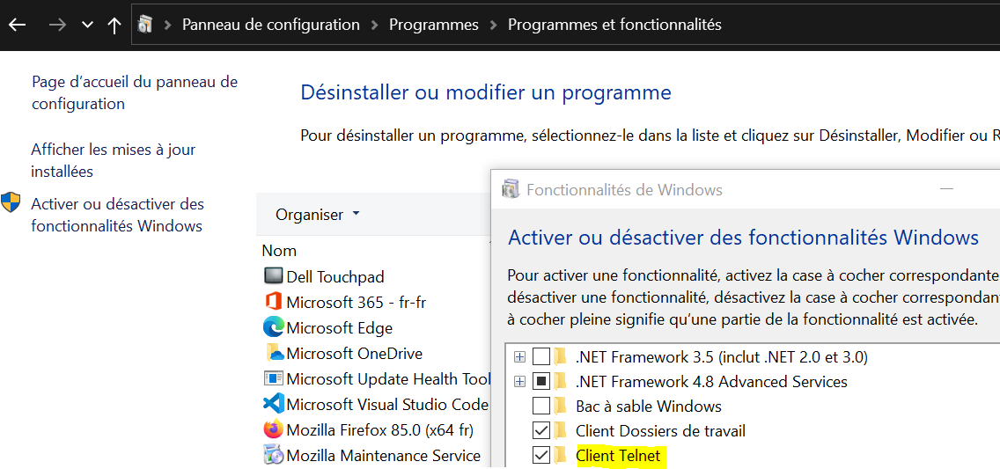

# TELNET

Panneau de configuration\Programmes\Programmes et fonctionnalités > Activer ou désactiver des fonctionnalités Windows > Client Telnet

# Commandes réseaux

```batch
telnet
	help
nslookup
	nslookup –type=mx gmail.com
Arp
arp -a
Hostname : nom hôte
Ipconfig : adresse IP du PC et passerelle de la Box
	ipconfig /all
	ipconfig /flushdns
Nbtstat
Netstat : ports ouverts.
	netstat -a
	netstat -abn
Netdiag
Nslookup
Pathping
Ping : temps de réponse d'un serveur distant
	ping 192.168.1.1
	ping www.google.be
Route
Tracert
```


# Partage réseaux

> [](https://support.microsoft.com/fr-fr/windows/partage-de-fichiers-sur-un-r%C3%A9seau-dans-windows-10-b58704b2-f53a-4b82-7bc1-80f9994725bf)

+ Créer un dossier
+ clic droit > Accorder l’accès à > Des personnes spécifiques > Partager
+ Mettre l'ordinateur en veille => Jamais
+ Profil réseau > Privé
+ Windows Update > Mise à jour disponibles
+ Vérifier les fichiers partagés : `\\localhost`
+ Panneau de configuration\Réseau et Internet\Centre Réseau et partage
	+ Privé > sélectionnez Activer la découverte de réseau et Activer le partage de fichiers et d’imprimantes
	+ Tous les réseaux > Désactiver le partage protégé par mot de passe
+ Exécuter > services.msc > ok > ...
	+ Hôte du fournisseur de découverte de fonctions
	+ Publication des ressources de découverte de fonctions
	+ Découverte SSDP
	+ Hôte de périphérique UPnP
	... Propriétés > Démarrer > Type de démarrage > Automatique
```
C:\WINDOWS\system32\svchost.exe -k LocalService -p
C:\WINDOWS\system32\svchost.exe -k LocalServiceAndNoImpersonation -p
```
# Synchronisation

> [](https://www.ubackup.com/fr/synchronisation/synchroniser-deux-dossiers-avec-robocopy-dans-windows.html)  
> [](https://caughtinpixels.com/how-to-create-a-backup-script-using-robocopy/)  

```batch
@echo off
net use P: \\PC-SAM\Partage /persistent:yes

set "src=C:\Data"
set "dst=P:\Data"

robocopy %src% %dst% /COPY:DAT: /E /MIR /MT:32 /MOT:1 /W:5 /R:10 /REG /XA:SH /V > C:\externalbackup.log

:: /E		copie les sous les sous-répertoire vide ou non
:: /COPY:DAT:	copie Données, Attributs et l'Horodatage (T)
:: /MOT:1	surveille modifications puis synchronisation à la dst
:: /MT:32	copie de 32 fichiers simultanées (par défaut : 8, à 128)
:: /MIR     copie miroir (supprimer fichier qui n'existe plus)
:: /W:0     nombre de secondes d'attente si le fichier est bloqué
:: /R:1     nombre de tentatives si le fichier est bloqué
:: /REG     sauve les valeurs de /W et /R dans les registres
:: /XA:SH   ignore les fichiers cachés
:: /FFT     éviter de recopier des fichiers déjà présent sur Linux
:: /V		journalisation des fichiers ignorés
:: >>       écrit à la suite du fichier

net use P: /delete
@echo on
pause
exit
```

# Planification

+ CMD > `%windir%\system32\taskschd.msc /s`
+ Planificateur > Action > Créer une tâche de base...
+ Name : *MyBackup*
+ Déclencheur : *Tous les jours*, démarre à *19:00:00* et se répète tous les *1* jour
+ Action : *Démarrer un programme*
+ Programme : `C:\Data\script.bat`
+ Terminé