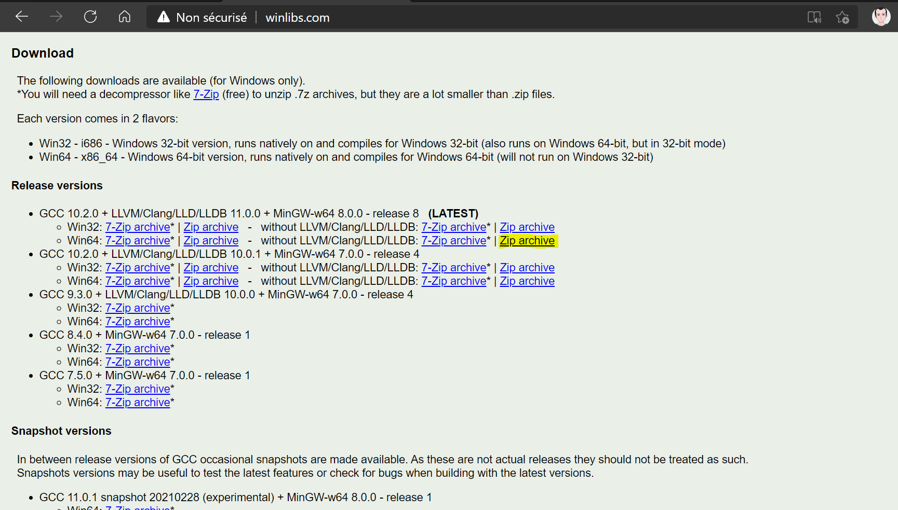

# [Tutoriel Windows - installer MinGW](https://www.youtube.com/watch?v=y-i96kqT53A&t=504s)

http://winlibs.com/ pour installer les deux outils, le compilateur gcc (alias g++) sous forme d'archive (on l'installe où on veut) et le débogueur gdb.

Pour info, Mingw-W64-builds est l'installateur avec lequel il fallait encore aller trifouiller la variable d'environnement.

Il y a d'autres outils installer de manière transparente comme l'éditeur de liens.

Choix du 64 bits, les programmes ne seront exécutable que sur 64 bits et pas sur du 32 bits.



Pour info, les snapshots sont des versions encore plus à jour mais ne sont pas forcément recommandés par rapport à une version plus stable (Release versions).

Ce qui nous intéresse pour la formation :

`bin\gcc.exe`
`bin\g++.exe`
`bin\gdb.exe`
`bin\ld.exe #éditeur de liens.`

On le place où on veut, pour un répertoire 64 bits on le met ici, `C:\Program Files`. Pour un répertoire 32 bits, on le met ici, `C:\Program Files (x86)`. On peut aussi choisir de le mettre directement à la racine du système `C:\` quand on ne passe pas par un installateur ce qui permet alors d'avoir vue sur tout ce qui a été installé manuellement.

## On installe le chemin vers binaire à Path :

`C:\Programmes Files\mingw64\bin`

## On test :

```batch
C:\Users\sam>gcc -v
:: etc.
gcc version 10.2.0 (MinGW-W64 x86_64-posix-seh, built by Brecht Sanders)

C:\Users\sam>g++ -v
:: etc.
gcc version 10.2.0 (MinGW-W64 x86_64-posix-seh, built by Brecht Sanders)

C:\Users\sam>gdb -v
:: etc.
GNU gdb (GDB for MinGW-W64 x86_64, built by Brecht Sanders) 10.1
:: etc.
```

On test avec un code en c.

```c
#include <stdio.h>

int main(void)
{
    printf("Hello !\n");
    return 0;
}
```
```batch
C:\Users\sam\Desktop>gcc main.c -o prog
C:\Users\sam\Desktop>prog
Hello !
```

On test avec un code en c++.

```c++
#include <iostream>

int main()
{
    std::cout << "Hello !" << std::endl;
    return 0;
}
```
```batch
C:\Users\sam\Desktop>g++ main.cpp -o progpp
C:\Users\sam\Desktop>progpp
Hello !
```